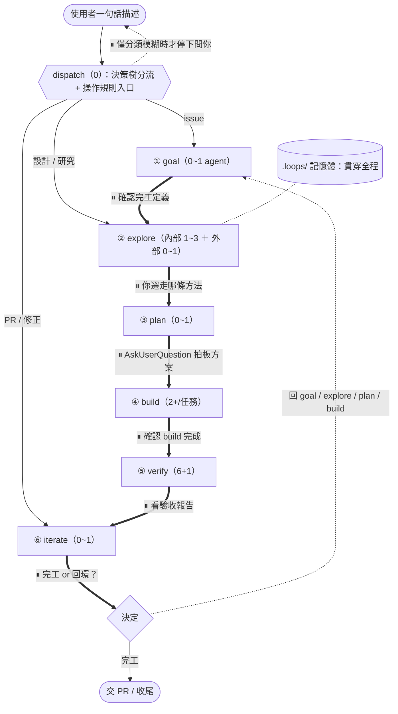

# loops-workflow plugin — 設計紀錄（DESIGN.md）

> 測試性 plugin。**以使用者自己的 work-plugins / cto-review 工作模式為重心**，用 **Loops Engineering** 的閉環哲學把它組織起來，再用 **agent-skills** 的成熟做法補填真缺口。完全自包含、可獨立實驗。
>
> 日期：2026-06-22。姊妹文件：`RESEARCH-agent-skills.md`（借鑑研究）、`AGENT-SKILLS-採用評估.md`（35 資產逐項採用決策，含 work-plugins 校準後的更正）。
>
> 出處與授權：借鑑自 `addyosmani/agent-skills`（MIT）。直接改寫其內容的檔案標註 `adapted from addyosmani/agent-skills (MIT)`。

---

## 1. 動機與三層融合定位

現有 work-plugins 三棒已是一種開發迴圈，但偏線性、沒把「迴圈」當第一級概念。本 plugin 用三個來源各補對方的洞：

| 來源 | 角色 | 貢獻 |
|------|------|------|
| 🎯 **work-plugins + cto-review**（使用者的） | **重心 / 骨幹** | 每階段做什麼、繁中規範、gate 紀律、reuse、clean-architecture、**cto-pr-reviewer 六 reviewer 引擎**、pm-feature-intake 訪談、issue→PR 工作模式 |
| 🔧 **agent-skills**（成熟） | **方法基底（補填缺口）** | 填 work-plugins 真缺口：refactor/簡化、威脅建模/OWASP、failure triage、source-driven、context 量化；其餘只補螺絲 |
| 🔄 **Loops Engineering**（哲學） | **組織框架** | dispatch 分流、Closed Loop gate、`.loops/` 記憶體、iterate 回環、停止條件 |

**核心紀律（經 work-plugins 校準後）**：agent-skills 真正**整支採用**的只剩 **5 個** —— `code-simplification`、`security-auditor`+`security-checklist`、`debugging-and-error-recovery`、`source-driven-development`、`context-engineering`。其餘要嘛**借螺絲**、要嘛**被 work-plugins/cto-review 涵蓋**（五軸 review / 訪談 / 任務拆解 / commit / ADR）。

> 校準教訓：先前誤把「五軸 review」「一次一問訪談」「任務拆解」當缺口，實際 `cto-pr-reviewer` / `pm-feature-intake` / `plan-from-issue` 早已涵蓋且更強。agent-skills 從「主角」退回「補螺絲」—— 這才是真正的「work-plugins 為重心」。

---

## 2. 完整工作流程（資產 ／ 做什麼 ／ 幾個 agent ／ agent 做什麼）

### 2.1 主流程圖



**每個 ⏸（粗箭頭）都是 human gate —— 階段做完停下等你，goal/explore/plan 全都會停。** dispatch 的「停下問」是特例：只在分類模糊時。gate 分兩種性質：

| 階段間 gate | 性質 | 你在 gate 做什麼 |
|------|------|------|
| `dispatch` | 釐清（**僅模糊時**） | 分類不確定才停；確定就直接路由 |
| `goal → explore` | 確認 | 完工定義 + 停止條件對不對 |
| `explore → plan` | **決策** | 看內部 vs 外部攤開比較，選走哪條方法 |
| `plan → build` | **決策（拍板）** | `AskUserQuestion` 拍板方案 + 確認任務拆解 |
| `build → verify` | 確認 | 看 build 完成（紅綠軌跡 + commit） |
| `verify → iterate` | 確認 | 看驗收報告（6 reviewer 缺口 + Ready/Not ready） |
| `iterate` | **決策** | 決定完工交 PR、或回哪階段重來 |

### 2.2 四維詳表

| 階段 | 做什麼 | 採用資產（🎯work-plugins｜🔧agent-skills｜🔄Loops） | 幾個 agent | 每個 agent 做什麼 |
|------|--------|------|:---:|------|
| `dispatch` | 讀決策樹判類型 → 建 `loop.md` → 交棒 | 🔧 using-agent-skills（決策樹＋operating rules，借形式）｜🔄 分流入口 | **0** | —（主線做） |
| `goal` | 訪談逼出「完工定義 + 停止條件」 | 🎯 **pm-feature-intake（一次一問訪談）** / plan-from-issue 逐句拆｜🔧 interview-me 零件（HYPOTHESIS+CONFIDENCE / restate 六欄 / 95% 停止）｜🔄 停止條件 | **0~1** | （可選）讀大型 issue 群回素材 |
| `explore` | 內部找可重用 → 外部找做法 → 攤開比較推薦 | 🎯 project-onboarding / reuse｜🔧 **source-driven** / 內建 Explore / context-engineering｜🔄 探索 | **內部 1~3 ＋ 外部 0~1** | Explore 摸 codebase 回 digest；deep research 研究外部（經同意）；source-driven agent 查官方文件 |
| `plan` | 拆任務（每任務帶 verification）+ 方案拍板 | 🎯 **plan-from-issue + 設計計畫書 §0–§9** / clean-architecture / reuse｜🔧 planning-breakdown 任務模板/尺寸表 / ADR Consequences / doubt-driven｜🔄 規劃 | **0~1** | （可選）方案比較矩陣 + 架構稽核 |
| `build` | 逐任務 **紅→綠→重構**、分段 commit | 🎯 commit / test｜🔧 紅綠分離 / **code-simplification（Refactor）** / TDD 品質判準 / slicing / Save Point｜🔄 執行 | **2+／任務** | test-author 寫 failing test（看不到 impl）；impl-author 寫實作轉綠（不准改 test）；referee 仲裁 |
| `verify` | **以 cto-pr-reviewer 為藍本**：6 reviewer fan-out → validator 二輪 → merge | 🎯 **cto-pr-reviewer 六 reviewer + coordinator + validator + P0–P3** / review-from-issue｜🔧 **security-auditor 威脅建模/OWASP 補強** / code-simplification 反例 / doubt-driven 反偏見 / Metric-Honesty｜🔄 驗證 | **6 ＋ 1 validator** | 6 reviewer 各一軸（見 §8.3）；validator 二輪確認 finding 真實性 |
| `iterate` | triage 失敗、決定回環、收尾 | 🎯 fix-from-pr / pr｜🔧 **debugging triage** / doubt-driven RECONCILE 四分類 / Pre-Launch checklist｜🔄 iterate 回環 | **0~1** | （可選）爬 PR 三來源回饋 + 分類 |

**貫穿全程**：🎯 comment（繁中 / 白話 / 雙視角 / tmp 草稿）＋ 🔧 skill-anatomy 骨架 ＋ context-engineering 量化 ＋ Change Summaries 交接 ＋ 🔄 `.loops/` 記憶體 + Closed Loop gate。

---

## 3. 與 Loops Engineering 的對應

| 要素 | 落地 |
|------|------|
| 目標 | `goal` 完工定義（pm-feature-intake 訪談 + restate 六欄） |
| 上下文 | `.loops/` 各階段 markdown，下一階段只讀精煉版（<2000 行） |
| 行動 | 階段獨立、各自只讀需要的 `.loops/` 檔 |
| 回饋 | build 紅綠分離 + verify 6 reviewer + validator + Metric-Honesty |
| 停止條件 | `goal` 定義、`verify` 對照、`iterate` 3 圈上限 |

| 6 根基 | 對應 |
|--------|------|
| Skills | 7 階段 skill |
| Subagents | explore 內建 Explore、build 紅綠分離、verify 6 reviewer + validator（主線親自派、不巢狀） |
| Memory | `.loops/<slug>/` markdown |
| Plugins & Connectors | GitHub（`gh`）、context7 MCP（source-driven） |
| Automations / Worktrees | 本次不做（見 §11）/ 沿用既有習慣 |

---

## 4. 拍板決策一覽

| 決策 | 選擇 |
|------|------|
| 架構取向 | 完全自包含、獨立重構 |
| 位置 | 全新 marketplace `~/.claude/plugins/marketplaces/loops-workflow/` |
| 呼叫前綴 | `loops-workflow:` |
| 推進模式 | Closed Loop（階段間 human gate） |
| dispatch | 比照 `using-agent-skills` 決策樹 + operating rules（不 paraphrase 串接） |
| 重心 | work-plugins + cto-review（agent-skills 只補 5 個真缺口 + 借螺絲） |
| verify 引擎 | 以 `cto-pr-reviewer`（6 reviewer + coordinator + validator）為藍本 |
| 對外語言 | 敘述繁中、identifier / 路徑 / 指令英文 |

---

## 5. Plugin 結構

```
plugins/loops-workflow/
├── .claude-plugin/plugin.json
├── skills/
│   └── dispatch/ goal/ explore/ plan/ build/ verify/ iterate/
├── agents/                          ← persona（被 build/verify skill 主線親自派）
│   ├── test-author.md   （寫 failing test，context 不含 impl）
│   ├── impl-author.md   （寫實作轉綠，不准改 test）
│   ├── referee.md       （紅綠衝突仲裁）
│   ├── product-contract-reviewer.md   ┐
│   ├── architecture-reviewer.md       │ verify 6 reviewer，
│   ├── security-reviewer.md           │ 對齊 cto-pr-reviewer 六角色，
│   ├── performance-reviewer.md        │ security-reviewer 另補
│   ├── code-quality-reviewer.md       │ 威脅建模/OWASP（borrow security-auditor）
│   ├── tests-reviewer.md              ┘
│   └── finding-validator.md  （二輪驗證 finding 真實性，borrow cto-pr-reviewer）
└── references/                      ← 長 checklist / 模板（progressive disclosure，>100 行才拆）
    ├── security-checklist.md         （OWASP + LLM Top 10）adapted from agent-skills (MIT)
    ├── code-simplification.md        （Chesterton's Fence + 過度簡化反例）adapted (MIT)
    ├── reviewer-severity.md          （P0–P3 / Confidence / Route）borrow cto-pr-reviewer
    ├── finding-validation.md         （二輪驗證判準）borrow cto-pr-reviewer
    ├── goal-restate-schema.md / task-template.md / change-summaries.md / adr-template.md
```

> `commands/` 不做（Claude Code 裡 skill 即 `/loops-workflow:dispatch` 入口）。`hooks/`（SDD-CACHE）、`docs/` 列可選，本次先不做。

---

## 6. dispatch（比照 using-agent-skills）

`/loops-workflow:dispatch <一句話描述>` —— 分流 + 立規矩 + 交棒。

**決策樹**：
```
├─ issue 號 / 「做 issue」 ──────────▶ 從 goal 開始（完整迴圈）
├─ 「設計/研究/評估」+ 無 issue ────▶ 從 explore 開始（Open Loop）
├─ PR 號 / 「reviewer/修正」 ───────▶ 從 iterate 開始
└─ 模糊 / 衝突 ─────────────────────▶ 停下來問你
```

**Operating Rules 入口**：把全程不變的紀律（繁中對外 / human gate 不可跳 / `.loops/` 每階段交接 / Metric-Honesty）集中寫在 dispatch，七階段不各自重述 —— 借 `using-agent-skills` 的「集中定義共用守則」架構位置。這讓 dispatch 是「中央說明書 + 分流台」而非純路由。

---

## 7. 六階段職責

### ① goal — 設定目標
- **做**：訪談逼出「明確完工定義 + 停止條件」。
- **以 🎯 `pm-feature-intake` 為主**：適應性澄清訪談（一次一問、`AskUserQuestion` 四選項、推薦標記、就緒度 Level、只問 blocking 決策不無止境逼問）。🎯 `plan-from-issue` 逐句拆既有 issue。
- **🔧 補 `interview-me` 零件**：HYPOTHESIS+CONFIDENCE 數字、**restate 六欄**（Outcome / User / Why now / Success / Constraint / Out of scope）、95% 信心停止、explicit-yes gate。
- **產出**：`00-goal.md`。**gate**：確認完工定義。

### ② explore — 探索（一條龍）
1. **先掃內部**：內建 `Explore`（Haiku、read-only）摸 codebase 找可重用（🎯 reuse + project-onboarding）。
2. **再搜外部**：便宜 WebSearch / firecrawl 看業界做法。
3. **不夠才深入**：需看實作細節（如 vscode command pattern）才建議升級 deep-research（經你同意）。
4. **框架查證**：🔧 `source-driven-development`（DETECT→FETCH→IMPLEMENT→CITE，context7、查不到標 `UNVERIFIED`）。
5. **攤開比較**：內部 vs 外部並排 + 推薦 → `01-explore.md` → gate。

### ③ plan — 規劃
- **做**：方案拍板 + 拆成「每個都能獨立 verify」的任務。
- **以 🎯 `plan-from-issue` + 設計計畫書 §0–§9 為主**：決策留痕（decision record 五欄）、機制圖（每機制白話 + 兩張 mermaid）、`AskUserQuestion` 拍板、套件評估（≥3 候選比較表）、clean-architecture 六維度、reuse。
- **🔧 補 `planning-and-task-breakdown` 螺絲**：任務模板（含 **Verification 具體指令**欄）、尺寸表 + 「該再拆」四訊號、依賴圖 + 每 2-3 任務 checkpoint；ADR `Consequences` 欄（borrow documentation-and-adrs）。
- **產出**：`02-plan.md`。**gate**：拍板方案。

### ④ build — 執行（紅→綠→重構，詳見 §8.2）
- **做**：主線編排，逐任務跑紅綠分離 + **Refactor step**，分段 commit。
- **🔧 借**：紅綠分離、**`code-simplification`**（Refactor step：Chesterton's Fence + 過度簡化反例 + 「簡化需改 test = 改了行為」紅旗）、TDD 測試品質判準（餵 test-author）、slicing（Risk-First）、Save Point。🎯 commit（繁中分段）/ test。
- **產出**：`03-build.md`（Change Summaries 三段式）。**gate**：build 完成。

### ⑤ verify — 驗證（以 cto-pr-reviewer 為藍本，詳見 §8.3）
- **做**：主線親自 fan-out 6 reviewer → validator 二輪驗證 → merge 成 Ready/Not ready。
- **產出**：`04-verify.md`。**gate**：看驗收報告。

### ⑥ iterate — 迭代
- **做**：triage、決定回環（≤3 圈）、完工則收尾。
- **🔧 借 `debugging-and-error-recovery`**：Stop-the-Line、六步 Triage、根因修 + 每修加回歸測試；doubt-driven **RECONCILE 四分類**；Pre-Launch checklist 收尾骨架。🎯 fix-from-pr 三來源回饋 / pr。
- **停止**：3 圈上限，超過 escalate。每次回環在 `loop.md` 記一筆。

---

## 8. 各階段 subagent 策略與主線 context 控制

### 8.1 鐵律
主線只留決策軌跡，重 context 動作（讀檔、寫 code、跑測試、爬回饋）外包給 subagent，只接收「精煉結論 + 紅綠 / 通過與否」。量化（borrow context-engineering）：一次餵 focused context **<2000 行**；context window ≠ attention budget。

### 8.2 build 紅綠分離 + Refactor（解決測試遷就實作 + 整潔）
主線當編排者，對每個任務：
1. 派 **test-author**（只有需求 / 契約 + TDD 品質判準，**看不到 impl**）→ failing test。
2. 主線跑測試 → 確認 **Red**。
3. 派 **impl-author**（有 test + plan，**不准改 test**）→ 寫實作轉綠。
4. 主線跑測試 → 確認 **Green**。
5. **Refactor**（impl-author 綠燈後、test 保護下整理結構不改行為）：套 `code-simplification` —— Chesterton's Fence（改/刪前先答「為什麼當初這樣寫」）、過度簡化四陷阱、**紅旗「簡化若需改 test 才能過 = 改了行為，停」**。
6. **衝突仲裁**：impl-author 主張 test 錯 → 回報主線，主線依完工定義裁決（必要派 referee）。
7. 主線分段 commit（Save Point）+ 寫 `03-build.md`（Change Summaries）。

**為何不偏**：test-author 沒看過 impl、只對需求寫；impl-author 不能改 test 遷就自己 —— feedback（test）與被測對象（impl）分屬不同 context（同 doubt-driven「不給 reviewer 結論」）。Refactor 在 test 保護下動，整潔不破壞行為。

### 8.3 verify 以 cto-pr-reviewer 為藍本（六 reviewer + validator）
**這是 work-plugins 重心的落實 —— verify 的引擎是你自己的 `cto-pr-reviewer`，不是 agent-skills 的 persona。** 主線在**同一回合一次發 6 個 Agent call**（並行、fresh context、不巢狀），各一軸：

| reviewer | 一軸 | 補強 |
|------|------|------|
| product-contract | issue 驗收 / 範圍 / 非目標 | 🎯 review-from-issue 逐句驗收 |
| architecture | 分層邊界 / import 方向 / 契約 | — |
| **security** | auth/authz / 注入 / 敏感資料（PR-diff 層） | 🔧 **補 `security-auditor` 威脅建模 / STRIDE / OWASP+LLM Top 10**（cto-pr-reviewer 只到 diff，這補系統級稽核） |
| performance | query / N+1 / index / transaction | — |
| code-quality | 錯誤處理 / typing / **可讀性與簡潔** | 🔧 code-simplification 過度簡化反例當 readability checklist |
| tests-release | 測試覆蓋 / 邊界 / migration | 🔧 doubt-driven 反偏見（**不給「作者說已通過」的結論**） |

接著：
- **coordinator**（主線）：去重、過濾純 style / 低信心。
- **finding-validator**（1 個 subagent，borrow `finding-validation.md`）：二輪確認每個 blocking finding 是否真實、是否本次引入、是否已被既有防護處理。
- **分級**：P0–P3 + Confidence 50/75/100 + Route（borrow cto-pr-reviewer）。
- **通用螺絲**：所有 reviewer 套 **Metric-Honesty Rule**（沒實跑就標 `not measured`）。
- 主線 merge 成 **Ready / Not ready** 寫 `04-verify.md`。

### 8.4 逐階段 agent 數總結
agent 集中在 **explore（發散讀）/ build（紅綠分離寫）/ verify（6 reviewer 發散驗）**；goal/plan/iterate 收斂回主線。發散用 subagent 並行擴大覆蓋，收斂（做決定、寫 code）回單一可控主線。

---

## 9. skill 標準骨架（borrow skill-anatomy）

每 skill（敘述繁中）：
```
frontmatter: name + description（第三人稱 what + 「Use when」；絕不摘要 workflow 步驟）
## Overview / When to Use（含 NOT for）/ Process
## Common Rationalizations（藉口 vs 反駁表）   ← 防跳步驟
## Red Flags / ## Verification（證據 checklist）  ← 沒證據不准說完工
```
Progressive disclosure：patterns <50 行 inline；reference >100 行拆進 `references/`。

---

## 10. `.loops/` context handoff

```
.loops/<task-slug>/
├── loop.md          ← 儀表板：類型 / 當前階段 / 停止條件 / 回環歷史
├── 00-goal.md       ← restate 六欄 + 停止條件
├── 01-explore.md    ← 內部 vs 外部攤開比較 + 推薦 + source-driven 引用
├── 02-plan.md       ← 任務清單（每任務帶 verification）+ ADR + 機制圖
├── 03-build.md      ← Change Summaries 三段式 + commit 清單 + 紅綠軌跡
├── 04-verify.md     ← 6 reviewer 缺口（P0–P3）+ validator 結果 + Ready/Not ready
└── 05-iterate.md    ← triage + 回環決策
```
`.loops/` 加進 `.gitignore`（規劃工件）。任一階段被獨立呼叫先讀 `loop.md`。每份檔 <2000 行。

---

## 11. 不在本次範圍（YAGNI）

> 釐清：本 plugin **有**分工式並行（explore 各查一角、verify 6 reviewer 各驗一軸、build 紅綠分離）—— 多 agent 各做**不同**子任務。下面排除的 Fleet 專指競賽 / 投票式編隊。

- **Open Loop 自動連跑**（已選 Closed Loop）。
- **Fleet 競賽式編隊**（多 agent 跑同一份工作再投票）。
- **跨 session resume / journaling**（靠 `.loops/` 手動接續）。
- **`.loops/` 升級成腳本可驗證的計畫檔** / **eval harness**（進階）。
- **Automations**（`/loop` / 排程）、**hooks/**（SDD-CACHE）、**docs/**、**commands/**。
- 🔴 不採用的 agent-skills 資產（見 §12）。

---

## 12. 採用資產總表（work-plugins 校準後）

完整逐項見 `AGENT-SKILLS-採用評估.md`。校準後：

**🟢 整支採用（5，agent-skills 真缺口）**：`code-simplification`（build Refactor）、`security-auditor`+`security-checklist`（verify security 補威脅建模/OWASP）、`debugging-and-error-recovery`（iterate triage）、`source-driven-development`（explore 框架查證）、`context-engineering`（context 量化）。＋ `skill-anatomy` / `doubt-driven` / `orchestration-patterns`（共用方法）。

**🟡 借螺絲**：`using-agent-skills`（dispatch 決策樹形式）、`interview-me`（goal HYPOTHESIS+CONFIDENCE/restate 六欄）、`planning-and-task-breakdown`（plan 任務模板/尺寸表）、`docs/agents.md`（fan-out 決策矩陣 + 不巢狀）、`incremental`（slicing）、`TDD`/`testing-patterns`（測試品質判準）、`git-workflow`（Save Point + Change Summaries）、`documentation-and-adrs`（ADR Consequences）、`shipping-and-launch`（Pre-Launch checklist）、`security-and-hardening`（Threat Model First）、`performance-optimization`（measure-first + Metric-Honesty）、`browser-testing`（UI bug 閉環）、`idea-refine`（發散 lens）、`spec-driven`（success criteria）、`api-design`（Contract First）。

**🔴 不採用（被 work-plugins/cto-review 涵蓋，或領域太窄）**：
- 被 `cto-pr-reviewer` 涵蓋：`code-reviewer`、`code-review-and-quality`、`test-engineer`（五軸 review + 測試覆蓋已由 6 reviewer + validator 更強涵蓋）。
- 領域太窄：`frontend-ui-engineering`、`ci-cd-and-automation`、`deprecation-and-migration`、`observability-and-instrumentation`、`accessibility-checklist`、`observability-checklist`、`web-performance-auditor`（前端特定，效能改 code-quality reviewer 條件性帶）。

**🎯 work-plugins / cto-review（重心，各階段骨幹）**：goal（pm-feature-intake · plan-from-issue）/ explore（project-onboarding · reuse）/ plan（plan-from-issue + 設計計畫書 · clean-architecture · reuse）/ build（commit · test）/ verify（**cto-pr-reviewer 六 reviewer + coordinator + validator** · review-from-issue）/ iterate（fix-from-pr · pr）；共用 comment。
