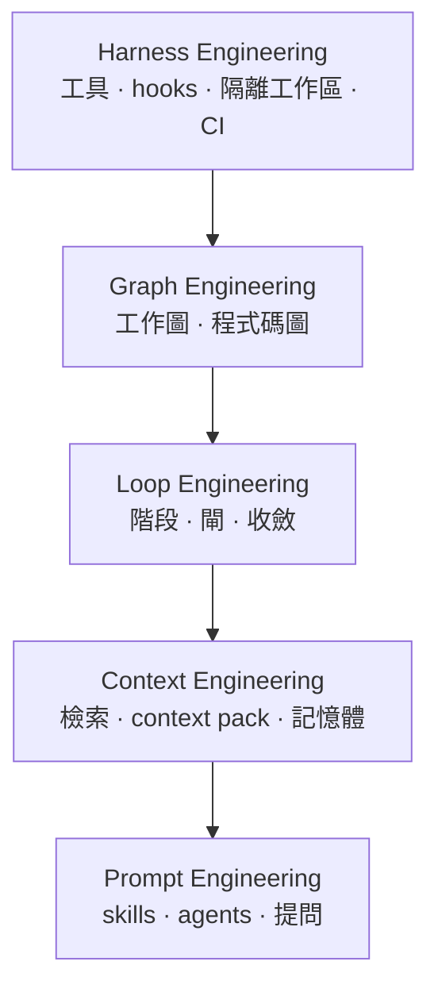

<!-- loops-artifact: concept-doc@1 -->
# 架構：五層與兩張圖

這份文件講**這套東西是怎麼組起來的**，以及每一層負責什麼、不負責什麼。你不需要讀完才能用（用法看 [`../README.md`](../README.md)），但當你想知道「為什麼某件事是那樣設計的」時，答案通常在這裡。

## 五層

由下往上讀比較好懂：**上面幾層都建立在下面幾層的保證之上**。

| 層 | 負責 | 不負責 |
|---|---|---|
| **Harness** | 動作真的發生的地方：工具呼叫、擋人的 hooks、隔離的工作區、CI | 判斷「該不該做」——那是規則的事 |
| **Graph** | 工作與程式碼之間的結構：這條 loop 有哪些節點、哪個符號被誰用到 | 決定流程走向 |
| **Loop** | 一條 loop 怎麼推進與收斂：階段、閘、回環判準 | 決定每一步看得到什麼 |
| **Context** | 每一步該看到什麼：檢索、context pack、記憶體 | 對模型怎麼說 |
| **Prompt** | 對模型怎麼說：skills、agents、要問人的問題 | 保證任何事——它只是說明，不是機制 |

**最重要的一句話**：能在下層機械保證的，就不要往上推給 prompt。一條「不准把改動直接併進主幹」的規則，寫在 prompt 裡是提醒、寫成 hook 才是保證。這個取捨在〈[規則怎麼被執行](POLICY-GUIDE.md)〉講得更細。

## 兩張圖：不要混淆

這套系統裡有**兩張完全不同的圖**，名字很像但用途相反。

### 程式碼圖（code graph）

- **是什麼**：你的專案裡有哪些符號、誰呼叫誰、誰 import 誰。
- **誰產生**：外部的 code graph 來源（見〈[安裝與來源](SETUP-GUIDE.md)〉）。
- **用來做什麼**：審查時查「改這個東西會波及誰」，不必整包重讀。
- **可信度**：**穩定的周邊可信，剛改過的檔不可信**——所以改動檔一律讀實檔，圖只查沒動過的部分。
- **什麼時候重建**：階段離開、build checkpoint、進 verify 前這種**批次邊界**；**不是每存一次檔就重建**。

### 工作圖（work graph）

- **是什麼**：這條 loop 本身發生過什麼——階段、決策、任務、產出、findings、閘、commit、PR、未知事項。
- **誰產生**：由 loop 自己的事件流重建（見〈[記憶體怎麼運作](MEMORY-GUIDE.md)〉）。
- **用來做什麼**：resume、組 context pack、判斷「現在還有什麼擋著完工」。
- **可信度**：**事件流是唯一真相源**；圖是可以整個刪掉重建的衍生物。

一句話分辨：**程式碼圖講「你的專案長什麼樣」，工作圖講「這次開發做過什麼」。**

## 規則落在哪一層

每條規則依**可判定性**分四級，各級由不同機制承接。完全機械的就別交給模型記憶，需要語意判斷的就別硬寫成字串比對。

| 級別 | 誰執行 | 例子 |
|---|---|---|
| 硬性不變式 | 工具呼叫前擋下 | 不准把改動直接併進主幹 |
| 流程不變式 | 流程狀態閘 | 沒過驗證不准開 PR |
| 語意要求 | 評測 | 沒實測就不准寫數字 |
| 建議 | skill 正文 | 階段之間不要一直問人「要不要繼續」 |

細節與「新增一條規則會經過什麼檢查」在〈[規則怎麼被執行](POLICY-GUIDE.md)〉。

## 哪些檔案可以手改

| 檔案 | 誰維護 | 手改會怎樣 |
|---|---|---|
| `README.md`、`docs/**` | **人**（就是你） | 沒事，但有一道一致性閘會檢查連結、指令名、來源清單與參數名跟事實對不對得上 |
| `AGENTS.md`、`plugins/**/skills`、`plugins/**/references` | AI 執行契約 | 可以改，但規則類的改動要走〈[規則怎麼被執行](POLICY-GUIDE.md)〉的流程，不能只改文字 |
| `.loops/<slug>/loop.md`、`PROGRESS.md` | **generated** | **會被下次重生蓋掉**——要改狀態請改事件流 |
| `references/*-registry.json`、`reference-graph-baseline.json` | 半 generated | 改它是刻意的一次提交；有測試會在它跟現實不符時紅燈 |

## 兩個平台

同一份規則、兩種投影。canonical 的規則文字**只維護一份**，平台差異用 adapter 表達，而不是各寫一份會漂移的版本。目前的能力差異與安裝方式見〈[Codex 快速開始](CODEX-QUICKSTART.md)〉。
