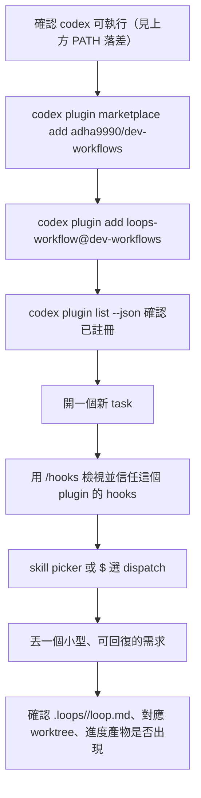

# Codex Preview 快速開始

> 這份文件教你在 **Codex**（desktop app 或 CLI）裡裝好、信任、跑起這個 marketplace。目前是 **Preview**：能裝、能跑最基本的一條路，但不是每項能力都跟 Claude Code 上一樣，誠實的落差列在下方「Preview 能力矩陣」。

## 這是什麼

Codex Preview 不是另外寫一份規則、也不是重新維護一套流程。`skills/`、`hooks/`、`references/` 這些內容跟 Claude Code 用的完全是**同一份**——Codex 只是多一個能讀到它的輕量入口檔（plugin 的身分證 + marketplace 的商店目錄）。你在 Codex 上打 `dispatch` 跑出來的閉環，跟在 Claude Code 上是同一顆引擎在跑，不會走到第二套邏輯。

標成 Preview，是因為目前只保證「裝得起來、最基本的一條路跑得動」，還沒有對每一項能力都在 Codex 上逐項驗證過——哪些量過、量出什麼結果，見下方能力矩陣，量不到的一律誠實標 `not measured`，不會因為「應該會動」就寫成已支援。

## 前置需求與支援範圍

- 一份支援 plugin / marketplace 功能的 Codex（desktop app 或 CLI 都可以，兩者共用同一套 plugin 機制）。
- 能連到 GitHub 的網路——marketplace 是直接從 GitHub repo 讀取的。
- **PATH 落差**：Codex 的執行檔不一定在系統 PATH 上（依安裝方式而定）。如果在終端機打 `codex` 出現「找不到命令」，有兩個選擇：
  1. 直接用 Codex desktop app 的介面操作（不需要在終端機打指令）。
  2. 找到 Codex 實際安裝的資料夾，自行把它加進 PATH。
- 這份文件是對照 Codex 目前的一個 **alpha 版本**驗證的；你手上的版本不同時，下方能力矩陣與步驟的實際行為都可能已經改變——遇到跟文件描述不一致的地方，先假設「版本差異」，再假設「裝錯」。

## 從安裝到第一個 smoke task

<!-- 以下每一步的指令語法引自官方規格查證；實際跑一遍的真機結果與版本覆蓋範圍見 docs/CODEX-SMOKE.md，本節內容待該證據回填後再做最終確認。 -->

1. **加入 marketplace**：在終端機執行 `codex plugin marketplace add adha9990/dev-workflows`（跟 Claude Code 的 `/plugin marketplace add` 是同一個 owner/repo 簡寫，但 Codex 這邊是在終端機打的 CLI 指令，不是聊天內的斜線指令——如果你是用 desktop app，同樣的動作可能改成在 UI 裡操作，實際入口以 app 介面為準）。
2. **安裝 plugin**：`codex plugin add loops-workflow@dev-workflows`。
3. **確認已註冊**：`codex plugin list --json`，應該能看到 `loops-workflow` 這個 plugin。
4. **開一個新 task**，讓 Codex 重新掃一次這個 plugin 帶來的 skill 與 hooks。
5. **信任 hooks**：用 `/hooks` 檢視這個 plugin 註冊了哪些 hooks，並明確按下信任。**這一步不能省略**——hooks 可以在你每次操作前後自動執行程式碼，Codex 安裝 plugin 之後**不會自動執行**它的 hooks，一定要你自己看過、信任過才會生效，這是防止未經同意的程式碼在你機器上執行的通用安全設計，不是這個 plugin 特有的額外關卡。
6. **叫出 dispatch**：從 skill picker 選，或用 `$` 呼叫——**不要假設這跟 Claude Code 的 `/loops-workflow:dispatch` 打法一樣**，Codex 的呼叫語法未必是斜線指令，實際打法以你當下看到的介面為準。
7. **第一個安全 smoke task**：丟一句話描述一個**小型、可回復**的需求（例如一個不會動到正式產品程式碼的小改動），讓它跑起一條 loop。
8. **確認產物**：跑完（或跑到第一個停下點）之後，去看你的專案目錄裡有沒有出現 `.loops/<slug>/loop.md`、對應的 git worktree（如果任務類型需要動 code）、以及進度產物——這三個是判斷「這條 loop 真的有在 Codex 上動起來」的具體依據，詳見下方「怎麼自己驗證」。

## 怎麼分辨「安裝問題」與「Codex Preview 尚未支援」

卡住的時候，先分兩類判斷，不要直接當成 bug：

- **整個 plugin 都沒出現**（`codex plugin list` 看不到、新 task 完全找不到任何 loops-workflow 的 skill）——這通常是安裝問題。檢查：網路能不能連到 GitHub、`marketplace add` 有沒有報錯、`plugin add` 有沒有報錯、有沒有真的開一個新 task 讓它重新掃過。
- **plugin 找得到、`dispatch` 也叫得動，但某個具體行為跟你預期的不一樣**（例如某個互動選單的樣子不同、某個防護機制好像沒攔到你）——先查下方「Preview 能力矩陣」，那一項很可能是 Codex Preview 現階段的已知落差，不是你裝錯。
- 矩陣裡標 `not measured` 的項目，代表目前沒有人在 Codex 上實際測過那一項——不是「保證能用」，也不是「保證不能用」。遇到這類項目，多一分小心，照下方「怎麼自己驗證」自己動手確認一次，不要假設它跟 Claude Code 的行為一致。

## Preview 能力矩陣

狀態只用這四個值：`supported`（已驗證可用）、`degraded`（部分可用或行為有落差）、`not supported`（已驗證不可用）、`not measured`（目前沒有實測資料）。**沒有實測過的一律 `not measured`，不會因為「理論上應該可以」就寫成已支援**。完整的驗證依據、方法論與已知限制見 [`docs/CODEX-SMOKE.md`](CODEX-SMOKE.md)，這裡只列結論、不重貼證據內容。

| 能力 | Claude Code | Codex Preview | 限制備註 |
|---|---|---|---|
| skill discovery / `dispatch` | supported | not measured | 尚未在已登入認證的環境中驗證 `dispatch` 是否會被發現與呼叫 |
| `setup`（plugin 安裝與註冊流程，跟未來規劃中的 `/loops-workflow:setup` skill 是兩回事） | supported | degraded | 對本 plugin 的真實內容驗證過：marketplace 註冊、安裝、確認整條流程免登入即可完成，版本號也核對一致；但安裝過程本身在什麼情況下會要求你登入認證，這件事還沒有被實際觸發過，尚不到能寫 supported 的程度 |
| `AskUserQuestion` 類互動 | supported | not measured | Codex 沒有同名工具，走的是它自己的互動機制，兩者是否等效尚未驗證 |
| subagent / model profile | supported | not measured | Codex 有自己的子代理機制，跟這套工作流怎麼搭配尚未驗證 |
| hooks 與 hook 信任 | supported | not measured | Codex 會發現既有的 hooks 設定、也可以分別信任，但這些防線實際上是否真的生效尚未驗證 |
| shell / `apply_patch` guard | supported | not measured | 官方文件記載了相容機制，但版本相關的已知問題是否影響、實際資料格式是否吻合，這兩點都尚未驗證——跑到會動 code 的任務時多一分留意 |
| worktree | supported | not measured | worktree 隔離在 Codex 環境下是否同樣可靠尚未驗證 |
| `.loops/` resume / progress | supported | not measured | 進度紀錄能不能在 Codex 端正確產生尚未驗證 |
| transcript / token metrics | supported | not measured | Codex 的逐輪紀錄格式能不能供既有的成本追蹤使用尚未驗證 |

<!-- 資料來源：quality-integrator 的 C3 交接（docs/CODEX-SMOKE.md commit b9e5aa1）。Claude Code 欄全數 supported 是既有產品既定行為，非本輪新驗證項目。 -->

## 怎麼自己驗證

跑完上面的 smoke task 之後，去確認這三件事：

1. 你的專案目錄裡有沒有出現 `.loops/<剛剛那個 loop 的 slug>/loop.md`，內容是不是包含目前階段、事件紀錄。
2. 有沒有建出對應的 git worktree（如果你的任務類型會動 code）。
3. 有沒有出現進度產物（例如一份可讀的階段儀表板）。

這三個是 loops-workflow 引擎本身既有的產物慣例，不管你用 Claude Code 還是 Codex 跑，形狀應該是一樣的。三個都出現、內容合理，代表 Codex Preview 這條路徑的核心閉環真的有跑起來；缺了哪一項，先回頭看上一節判斷是裝錯還是已知限制，不要直接當成隨機故障。

你也可以直接重跑一次「從安裝到第一個 smoke task」的每一步（包含 `codex plugin list --json`），確認每一步的輸出跟這份文件描述的一致——版本不同時，這是最快找出落差的方法。

## 常見問題 / 停用與移除 / 回報問題

**為什麼一定要我自己在 `/hooks` 按信任，能不能跳過？**
不能，也不建議跳過。Hooks 是在你每次操作前後自動執行的程式碼，信任機制是防止你在不知情的狀況下讓外部程式碼跑在你的機器上——這是 Codex 的通用安全設計，跳過等於關掉這層保護，不是這個 plugin 刻意設的關卡。

**明明照著裝了，還是找不到 `dispatch`？**
先看上面「怎麼分辨安裝問題與尚未支援」那節，多半是版本差異或某一步跑漏了（尤其是「開一個新 task 讓它重新掃過」這一步）。

**怎麼停用或移除？**
<!-- 確切的移除/停用指令待 T1 manifest 定案＋T3 真機驗證後回填；先給讀者能自己推導的一般作法。 -->
一般而言就是反向操作你安裝時用的指令（把「加入」換成對應的移除/停用操作）；如果你是透過 desktop app 的介面安裝的，同樣可以直接在介面裡找到停用或移除這個 plugin 的選項。

**這裡量到的東西跟我實際用起來不一樣，要去哪裡說？**
到這個 marketplace repo 的 GitHub Issues 開一張新 issue，附上你實際打的指令、看到的輸出，以及你用的 Codex 版本——這對把「Preview」逐步補完最有幫助。
