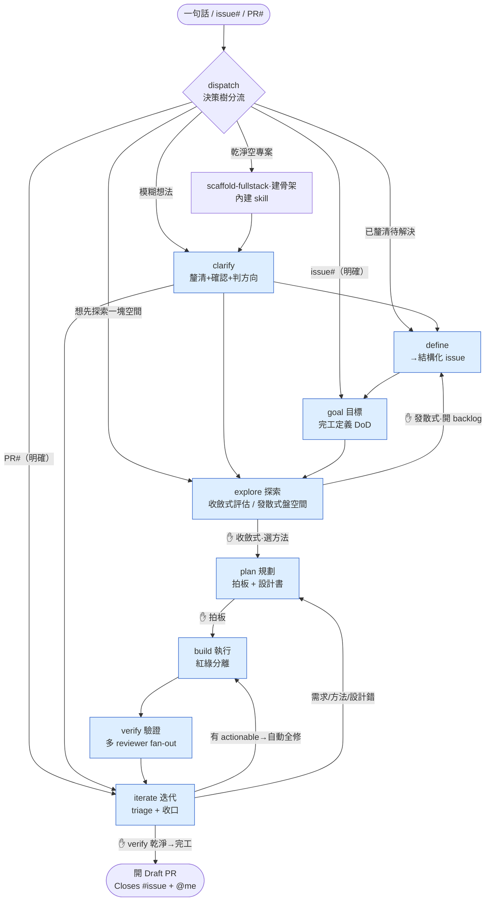
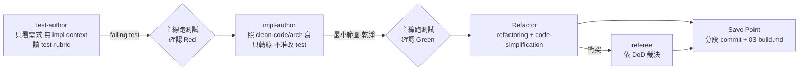
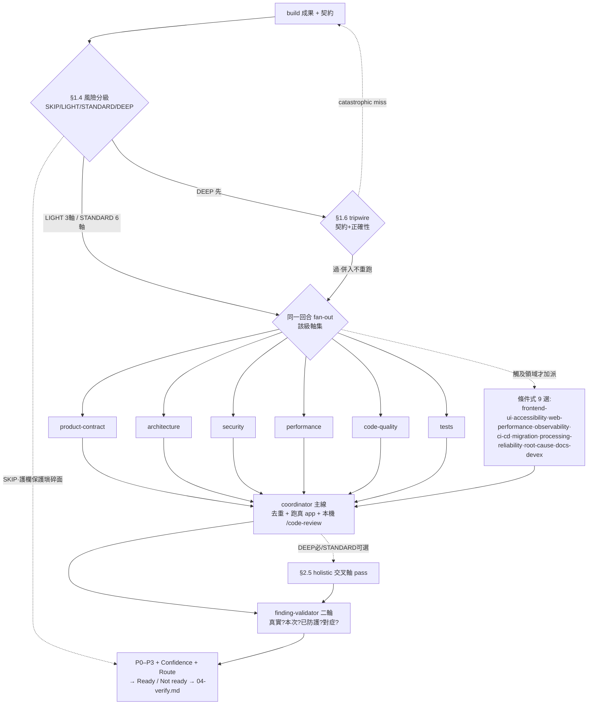

# loops-workflow 完整流程

> 一份「從一句話 / 一張 issue，到開出 PR」的全貌：每個階段用幾個 **skill / agent**、在處理什麼、用什麼**機制**、背後什麼**策略**。
>
> 設計源頭是 **Loops Engineering** 框架：把開發當成一個**閉環**，系統自己「探索→規劃→執行→驗證→迭代」直到達成目標；人類只在**真正要選的決策點**把關（Closed Loop）。核心洞見：迴圈很貴，難在**負擔得起** —— 全程靠高上下文效率、便宜的先·貴的 gate、不重複勞動撐住（但只砍非必要貴動作 + 浪費，不砍 define/gate/verify 這些 mandatory 流程）。

---

## 0. 總流程圖

**讀法**：實線往下是 routine（不問你、直接走）；`✋` = **會停下用 `AskUserQuestion` 問你**的真決策點。`iterate` 把問題修完會**回環**（看收斂、預設 ≤3 圈）再驗，全乾淨才完工開 PR。explore 有兩種出口：**收斂式**→plan（選一個方法）、**發散式**→define（把設計空間盤成 issue backlog，開完停下等後續逐步解，不強制續跑）。

**dispatch 依意圖清晰度分流**：明確（issue# / PR#）直進 goal / iterate；**模糊想法先進 `clarify`** —— 一次一問把模糊收斂成「經確認的理解 + 方向」，再分流到 define / explore / iterate（dispatch 自己不做訪談確認）。clarify 與 scaffold / define 同為 dispatch 路由的**前置階段**、不在 goal→…→iterate 迴圈圈內。

**階段間記憶體**：每階段把結論寫成 `.loops/<slug>/0N-*.md`（goal→`00-goal.md`、explore→`01-explore.md`…），下一階段只讀**精煉版**、不重讀原始素材。`loop.md` 是儀表板（當前階段 / session / Journal 事件日誌）。

---

## 1. dispatch — 決策樹分流（很薄）

| 項目 | 內容 |
|---|---|
| **skill** | `dispatch`（1）｜**agent** 0 |
| **處理什麼** | 判**意圖清晰度** → 建 `.loops/<slug>/loop.md` → 進起點階段（模糊先路由給 clarify） |
| **機制** | 決策樹：**乾淨空專案→scaffold**／issue#（明確）→goal／PR#（明確）→iterate／**模糊想法→`clarify`**（釐清+判方向）／已釐清待解決→`define`→goal／**想先探索一塊空間→explore→產出經 `define` 開功能 issue**。建 loop.md（類型·**operation 性質**·session id·當前階段）。**所有 issue 一律經 define + repo template 建、不 ad-hoc；無獨立研究 issue**（規則 12）。**會動 code 的迴圈開 git worktree**，但 `.loops/` 留主 repo（免被 worktree 清掉） |
| **策略** | **只分流、不串接** —— routine 不問你；**dispatch 自己不做訪談 / 複述確認**（模糊路由給 `clarify`），只有分類衝突 / scaffold 大動作才停 |

---

## 1.3 clarify — 釐清模糊需求（前置，模糊才進）

| 項目 | 內容 |
|---|---|
| **skill** | `clarify`（1，可獨立呼叫 `/loops-workflow:clarify`）｜**agent** 0（主線一次一問） |
| **何時** | dispatch 判請求是**模糊想法 / 含糊一句話**（非具體 issue#/PR#）才進；明確意圖跳過 |
| **處理什麼** | 把模糊的話收斂成「**經確認的理解 + 方向**」—— 問題 / 為何 / 範圍 / 不做 / 關鍵假設，再判落地→define/goal · 研究→explore · 修既有→iterate |
| **機制** | 一次一問（`AskUserQuestion` 標推薦、記 HYPOTHESIS+CONFIDENCE、should-want 偵測）→ restate + **一次確認** → 寫 `00-clarify.md` → 交棒。**不建 issue / 不釘 DoD / 不動 code** |
| **策略** | 釐清是**收斂**不是審問（信心夠就停、單次確認非逐項逼問）；只處理模糊，明確需求不加 ceremony；訪談**集中在這做一次**，define/goal 拿到的是已釐清的、不重問 |

---

## 1.4 scaffold-fullstack — 完全乾淨空專案先建骨架（前置，內建 skill）

| 項目 | 內容 |
|---|---|
| **skill** | `scaffold-fullstack`（**loops-workflow 內建 skill**，自帶整棵模板樹 + scaffold 腳本、無外部依賴）｜**agent** 0 |
| **何時** | dispatch 偵測目標**完全乾淨**（空目錄 / 無原始碼 / 無 `package.json` / 無 git 歷史）才觸發；既有 / 半成品專案不 scaffold |
| **處理什麼** | 沒架構承載 issue、也沒 code 可改 → 先立專案骨架（Fastify + React 19 + TanStack + Kysely/SQLite + Vitest 分層全端 TS） |
| **機制** | **一定停**用 `AskUserQuestion` 確認（scaffold 是大動作 + 棧定死）→ 合用就跑模板 + `pnpm install` + typecheck/lint/test 驗收 → 接後續（**發散式 explore** 盤 backlog／§1.5 **define** 單一問題）。要別的棧 → 提示自建骨架。也可直接 `/loops-workflow:scaffold-fullstack` 單獨跑 |
| **策略** | **內建、永遠可用**（無跨-plugin 耦合）；棧定死、不合用不硬塞 |

---

## 1.5 define — 所有 issue 的唯一入口（一律 repo template；研究服務功能，DEFINE 前置）

| 項目 | 內容 |
|---|---|
| **skill** | `define`（1，可獨立呼叫 `/loops-workflow:define`）｜**agent** 0 |
| **處理什麼** | 把**任何無 issue 的工作**變成 repo template-ready issue —— **建 issue 的唯一入口**。**無獨立研究 issue**：研究是功能 issue 的 explore 階段，或先研究再 define 開功能 issue |
| **機制** | **Readiness Model**（分 Level 0–4、目標 Level 3）→ 用 repo 的 issue template → **一次一問 intake**（釐清問題定義 / 成功準則 / 替代方案）→ scope sizing（太大先拆票）→ 多步流程放 flowchart → 草稿校稿 → `gh issue create --assignee @me` → 進 goal |
| **策略** | 先 inspect repo（template / 既有 issue）；寫作指示濾掉不寫進 ticket；含「審 / 重寫既有 ticket」模式。**每件要實作的工作都從 issue 起手（AGENTS 規則 12）—— 沒對應 issue 不直接 plan/build，一律先來這建一個** |

---

## 2. goal — 設定目標（完工定義）= VISION

| 項目 | 內容 |
|---|---|
| **skill** | `goal`（1）｜**agent** 0（主線一次一問訪談） |
| **處理什麼** | 把模糊需求逼成「明確完工定義 + 可驗證停止條件」 |
| **機制** | **逐句掃整張 issue**抽每個 requirement（不只看驗收標準段）→ **一次一問**訪談（記 HYPOTHESIS+CONFIDENCE、should-want 偵測）→ restate **六欄 DoD**（Outcome / User / Why now / Success / Constraint / Out of scope）+ 停止條件 |
| **策略** | 95% 信心就停；restate 六欄後做**一次 DoD 確認**再進 explore（單次對齊、非反覆逐欄逼問）。**issue 寫的實作做法 / 套件記成「建議」不是「需求」**，留給 explore 評估 |

---

## 3. explore — 探索（收斂式評估 / 發散式盤 backlog）✋

| 項目 | 內容 |
|---|---|
| **skill** | `explore`（1）｜**agent** **1 掃描**（`Explore` read-only 摸 codebase）**＋ N 評估**（≥2 個可行方法時、一候選一個 read-only agent）；發想新方案才 opt-in Fleet |
| **處理什麼** | 先找內部可重用的，不夠才看外部；**收斂式**：方法有競爭時做多維評估、攤開比較矩陣給推薦；**發散式**：把設計空間盤整成待解問題 backlog |
| **機制** | 摸架構（文檔優先）→ 掃內部找可重用 → **夠了沒判斷** → 不夠才外搜（便宜 WebSearch → gate deep-research）→ 框架 API 查證（DETECT→FETCH→**CITE**）→ **≥2 方法時多維評估 fan-out** → 比較矩陣 → 推薦 |
| **8 評估維度** | 效能（複雜度 + 接近真實/極端規模 benchmark）· 記憶體/體積 · 可維護 · 可擴展 · 安全 · 複雜度 · 重用 · 適配 |
| **策略** | **重用優先** · **外搜條件式**（省成本）· **方法不是「能用就用」**：① issue 的方法只是候選不是定案、贏家不同就換 ② 在接近真實/極端規模 benchmark 不憑感覺（能用 ≠ 好用，小樣本看不出、大規模才見真章）· 不只 MVP |
| **gate** | ✋ **收斂式**→ 選哪個方法（進 plan）／**發散式**→ 確認 backlog 範圍 + **基礎/獨立分層** + MVP 起點（進 define 開 issue backlog；薄基礎→寬平行，不開相依鏈） |

---

## 4. plan — 規劃（拍板 + 設計書）✋ = ARCHITECTURE

| 項目 | 內容 |
|---|---|
| **skill** | `plan`（1）｜**agent** 0；**風險大的設計可派 read-only 設計品質審查 agent**；發想多方案 opt-in Fleet |
| **處理什麼** | 動 code 前把設計拍板留痕、拆成可獨立 verify 的任務 |
| **機制** | 決策留痕（**ADR 五欄**）→ 套件評估（**≥3 候選**）→ **機制圖**（每機制：白話 + 運作流程圖 + 注入接線圖）→ **契約規格**（跨 API/資料/事件介面才寫，含 Hyrum's Law）→ 品質六維度 + 重用 + 設計模式對症 →（風險大才）派設計品質審查 → **拆可驗證任務**（垂直切片 / risk-first / XS–XL 尺寸）→ 送對齊 comment + 拍板 gate |
| **產出** | `02-plan.md` —— **§0–§9 完整施工圖**（系統全貌 + 檔案職責表 + 機制圖 + 名詞 + 決策含具名背書 + 三角驗證 + 成果展示） |
| **策略** | **最高標準不以 MVP** · **living plan**（偏離回來改）· 拍板前**渲染機制圖 + 攤「我的假設」清單**給你看，不准盲拍 |
| **gate** | ✋ 拍板方案 |

---

## 5. build — 執行（紅綠分離）

| 項目 | 內容 |
|---|---|
| **skill** | `build`（1）｜**agent** **每任務 2 個**（`test-author` → `impl-author`）；衝突時 **+1**（`referee`） |
| **處理什麼** | 逐任務把計畫變成 code，且測試不遷就實作、寫的當下就乾淨 |
| **策略** | **紅綠分離**：寫測試的看不到實作 → 不會把測試寫成遷就實作；寫實作的不能改測試 → 不能讓測試將就自己。**平行 build 各 writer 隔離 worktree**、合併後主線在合併態重驗（不採信 subagent 自報綠） |
| **寫碼標準（shift-left）** | impl-author **綠燈當下就照 verify 會查的同一套合併標準寫**：clean code + clean architecture + **安全**（輸入驗證 / authn-authz / 不洩敏感資料 / SQL 參數化）+ **重用**（寫前先確認沒有既有的）—— 標準在 build 與 verify 是**同一份 reference、兩處套用**；Refactor 是精修，不是補救爛 code（見 AGENTS 規則 11） |

> test-author 帶 `test-rubric.md`（四層測試 / Real>Fake>Stub>Mock / pyramid 80/15/5），並依 `loop.md` 的 `operation` 性質決定**紅燈第一步**（bug-fix 先寫重現測試 / refactor 先確認全綠無紅燈相…見 `operation-first-move`）；**impl-author 帶 `clean-code.md` + `clean-architecture.md` + `security-checklist.md` + `reuse-check.md`（綠燈當下就照合併標準寫、非先寫爛再救）**；Refactor 依 `refactoring.md`（異味 → 具名手法 → 設計模式時機）+ `code-simplification.md`（安全簡化紀律、精修非補救）；偏離 plan 就回去更新 `02-plan.md`。做完直接進 verify。

---

## 6. verify — 驗證（多 reviewer fan-out）= 回饋

| 項目 | 內容 |
|---|---|
| **skill** | `verify`（1）｜**agent** **依風險 0～6 核心（§1.4 4 級梯）+ 0～9 條件式 + holistic（DEEP必/STANDARD可選）+ N 個 finding-validator**（同一回合並行） |
| **處理什麼** | 合併前把關：多個獨立視角各審一軸，再二輪驗證 findings |
| **策略** | **fresh-context 獨立性** · **反偏見**（不餵作者 rationale、rubber-stamp 自查）· **Metric-Honesty**（沒實跑標 `not measured`）· **作者已留痕的決定不算 finding** · **獨立安全網非第一道品質關**（標準已在 build shift-left 套用，verify 複查 + 抓盲點） |

> **派幾軸由 §1.4 風險 4 級梯決定**：SKIP（護欄保護的瑣碎面，不派核心軸）/ LIGHT（小孤立 code，3 軸）/ STANDARD（一般 code，核心 6 軸）/ DEEP（高風險，先 §1.6 tripwire 短路 catastrophic miss、過了才放 6 軸 + §2.5 holistic 交叉軸 pass）。**非 code 改動（純 docs/設定）**：瑣碎→SKIP、有驗收契約的實質文件→product-contract + docs-devex（不入 code 級梯）。條件式 9 個只在改動觸及該領域才加派（與核心軸正交，SKIP 仍可帶 docs-devex；含 bug-fix→root-cause、docs/契約→docs-devex）。每個 blocking finding 過 `finding-validator` 四問二輪才算數。出 P0 才停下問你，否則直接進 iterate。

---

## 7. iterate — 迭代（triage + 收口）✋

| 項目 | 內容 |
|---|---|
| **skill** | `iterate`（1）｜**agent** 0（修正回 build 用其 subagent）；卡關時 **opt-in cross-model**（換別的模型當對手 reviewer） |
| **處理什麼** | 把 verify 缺口 / PR reviewer 回饋分類、修根因、決定回環或完工 |
| **機制** | 收集回饋（`type=fix` 走 `pr-feedback-sources.md`：inline comment 要 `gh api`）→ **RECONCILE 四分類** → **Stop-the-Line 修**（DIAGNOSE 先定位失敗層 + `git bisect` → 修根因 → 每修加回歸測試）→ **修完一定再 verify** → 完工 or 回環（看收斂·≤3 圈·不收斂即 escalate） |
| **完工交接物（依類型）** | **修正型**＝一份修正回覆 comment（`comment-policy` §8 版型：工程角度根因/怎麼修/怎麼驗＋客戶角度修正前→後；**不@reviewer**）；**完整迴圈**＝PR 收尾 comment + **自動產 explain**。follow-up 留當前 issue 不另開。PR body 放 `Closes #issue`、指派 `@me`、與 master 衝突自動合併 |
| **收尾清理（兩時機）** | ① **loop 結束時**（不論交不交 PR）清掉 loop 期間所有暫存：移除 worktree（`git worktree remove`/`prune`）、刪草稿/截圖/scratch · ② **PR 合併後**（solo 自己合併→自己清，**使用者核可後才 merge**）刪分支（`gh pr merge <PR#> --squash --delete-branch`，**一律 squash 單一 commit**、策略見 `pr-spec`〈merge 策略〉，只留 `main`+進行中）· loop 暫存一律不入庫（`.loops`/`.claude/worktrees`/`data`/`dev.json`/截圖 由 `.gitignore` 涵蓋，`git ls-files` 掃一遍） |
| **策略** | **交 reviewer 前把問題解到最少**（actionable 一律自動全修、不問「修多少」）· severity 只決定停不停、不決定修不修 · **回環看收斂**（findings 沒變少 / 同條復現就 escalate，不等第 3 圈）· **3 圈上限 = 檢查點非硬牆**（停下問你：回頭重想 / 換跨模型 / 授權再繞重置計數） |
| **gate** | ✋ 完工 or 回哪階段（修完再 verify 不是選項，一律再驗） |

---

## 8. explain — 工程師理解包（側用，不在迴圈裡）

| 項目 | 內容 |
|---|---|
| **skill** | `explain`（1，read-only）｜**agent** 0 |
| **處理什麼** | 幫人**看懂一份改動**怎麼接起來 + 自測是否真懂 |
| **機制** | 實作導讀（進入點→責任盒→介面邊→payload 流動 + mermaid + `file:line`）+ **5 題 ownership 自測** + 設計方向 recap |
| **策略** | 給**工程師**理解用（接手 / 維護 / 確認 Claude 做了什麼），不是給 reviewer。完整迴圈完工時自動產 |

---

## 8.5 agents-md-maintainer — AGENTS.md 文檔維運（側用，不在迴圈裡）

| 項目 | 內容 |
|---|---|
| **skill** | `agents-md-maintainer`（1，documentation-only）｜**agent** 0 |
| **處理什麼** | 漸進建 / 維護 repo 的 agent-facing 文檔（根 `AGENTS.md` + `docs/agent-doc-coverage.md` 追蹤表 + 各模組 `AGENTS.md`） |
| **機制** | 決策樹：缺根檔→建+停／缺追蹤表→建+停／都在→挑一個未覆蓋 / 過期模組掃描+建檔+更新追蹤表+停。**每次一個 scope**、檔名嚴格 `AGENTS.md`、最小有用文檔原則 |
| **策略** | **橫切文檔治理、不屬 feature 迴圈** —— 與 `explain` 同屬側用，**不被 `dispatch` 路由**；只動文檔不碰 runtime code |

---

## 9. 橫切面（貫穿所有階段的根基）

| 根基 | 在 plugin 裡是 | 對應 Loops Engineering 6 根基 |
|---|---|---|
| **記憶體** | `.loops/<slug>/`：`loop.md`（儀表板 + Journal）+ `0N-*.md`（各階段精煉產出） | Memory |
| **隔離工作樹** | 會動 code 的迴圈在 `git worktree`（`<issue#>-<slug>` 同名 branch） | Worktrees |
| **子代理** | build 紅綠 3 + verify 0～6 核心（§1.4 風險梯）+ holistic + 9 條件式 + validator | Subagents |
| **技能** | 13 個 skill（SKILL.md 統一骨架） | Skills |
| **連接器** | `gh`（GitHub issue/PR）、MCP 工具、`/run`·`/verify`·`/code-review` 環境能力 | Plugins & Connectors |
| **自動化** | `dispatch auto`、`/loop`·`/schedule`、statusline HUD | Automations |

**兩座標 + 一總綱**（見 `AGENTS.md`）：
- **類型**：Closed Loop（預設，人類框架內把關）/ opt-in Open（`auto` 連跑）。
- **規模**：單一迴圈（預設）/ opt-in **Fleet** 編隊。
- **★ 成本意識（規則 10）**：迴圈很貴 → 全程**高上下文效率**、**便宜的先·貴的 gate**、**不重複勞動**、**fail-fast**。**carve-out：只砍非必要貴動作（deep-research/Fleet/真機/多餘 reviewer）+ 浪費,絕不砍 mandatory 流程（define/issue-first/human gate/verify）—— 跳流程的 rework 才最貴。**

---

## 10. 數字總結

| | |
|---|---|
| **skill** | 13（dispatch / **clarify** 釐清模糊需求 / define / goal / explore / plan / build / verify / iterate / explain / **scaffold-fullstack** 內建 greenfield 骨架 / **agents-md-maintainer** 側用文檔維運 / **distill** 側用跨 loop 萃取 instinct） |
| **agent** | 21 = build 3（test-author / impl-author / referee）+ verify 6 核心 + holistic-reviewer + finding-validator + eval-judge（eval E4，無 oracle 維度評分、主迴圈/Workflow 派）+ 9 條件式領域 reviewer（accessibility / ci-cd / docs-devex / frontend-ui / migration / observability / processing-reliability / root-cause / web-performance，視改動面加派）。explore 多維評估 / plan 設計審查用內建 `Explore` / general-purpose（不計入此數） |
| **單一迴圈最多同時 agent** | verify 那一回合：6 核心 +（最多 9 條件式）+ holistic + N validator |
| **reference** | 46 份（含 clean-code / clean-architecture / design-patterns / refactoring / code-simplification 寫碼五標準 + 8 份 per-axis 審查判準 + verify-triage 風險分級 + operation-first-move + instinct-schema + eval-judge-rubric 無 oracle 維度評分卡 + eval-judge-panel / eval-live-candidate Phase 3 活流程 recipe）｜**command** loop / resume / status / explain / install-statusline｜**hook** 7 個 / 4 事件（SessionStart 恆跑、其餘 6 個 opt-in 預設關；皆永不擋路）：SessionStart(浮 active 迴圈 + instinct 注入 opt-in) + Stop(cost-tracker 估成本 + eval-gate 改檔回合自動跑 eval-metrics check 注入退化 + stop-gate 改檔回合自動跑 quality-gate) + PostToolUse(edit-accumulator 累積改檔) + PreToolUse(suggest-compact compact 提醒 + config-protection 擋弱化 linter 設定) |

---

## 各階段「用幾個 agent」速查

| 階段 | skill | agent | 何時 |
|---|---|---|---|
| dispatch | 1 | 0 | 只分流 |
| clarify | 1 | 0 | 模糊想法時（前置） |
| define | 1 | 0 | 無 issue 時 |
| goal | 1 | 0 | 主線訪談 |
| explore | 1 | **1 掃描 + N 評估** | 方法競爭時一候選一 agent |
| plan | 1 | 0（+設計審查 / Fleet 選用） | 風險大才派 |
| build | 1 | **2 / 任務**（test+impl）+ referee | 衝突時 referee |
| verify | 1 | **1–6 + 0–9 + holistic + N** | 同回合並行 |
| iterate | 1 | 0（+cross-model 選用） | 卡關時 |
| explain（側） | 1 | 0 | 唯讀 |
| agents-md-maintainer（側） | 1 | 0 | 維護 AGENTS.md（不入迴圈） |
| distill（側） | 1 | 0 | 手動萃取跨 loop instinct（不入迴圈） |
| scaffold-fullstack（前置） | 1 | 0 | 完全乾淨空專案建骨架 |

---

> **維護**：本檔同步自 plugin 各 `SKILL.md` / `agents/` / `references/` —— **改了流程（階段行為、agent 分工、機制、策略）就一併更新這份**，讓它跟著 SKILL 走、不 drift。這份是給人讀的全貌總覽，**正本機制仍以各 `SKILL.md` 為準**。
