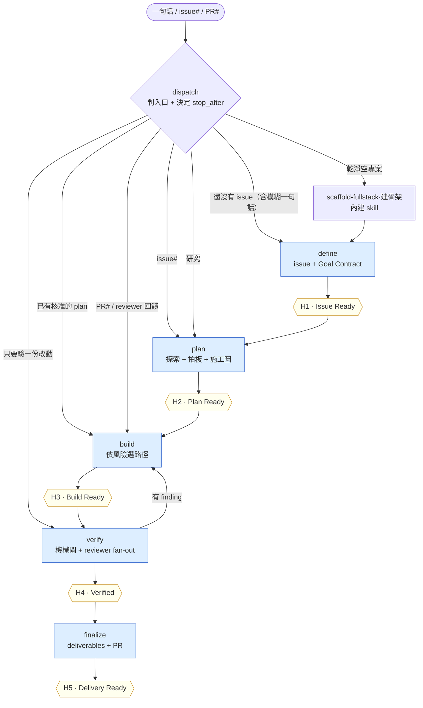
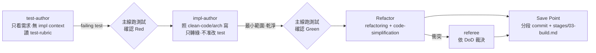
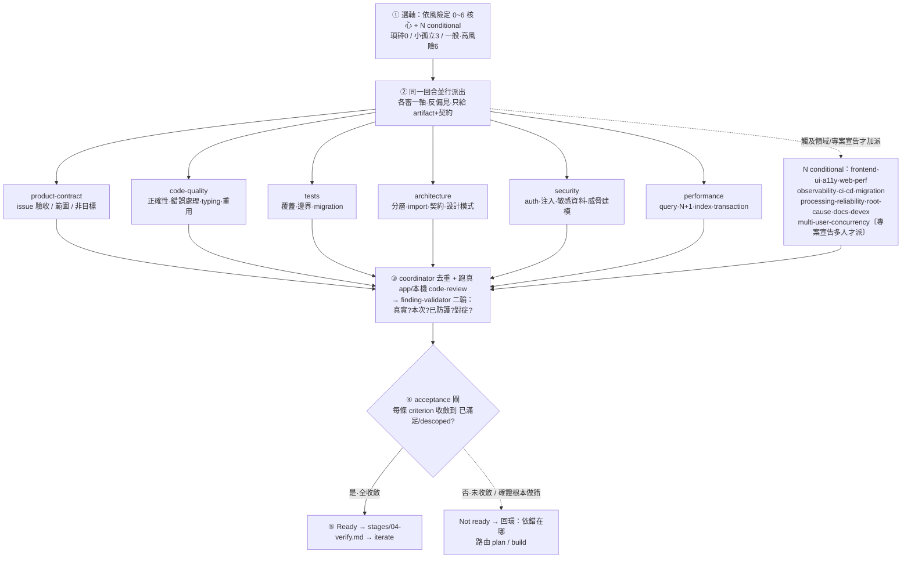

<!-- loops-artifact: concept-doc@1 -->
# loops-workflow 完整流程

> 一份「從一句話 / 一張 issue，到開出 PR」的全貌：每個階段用幾個 **skill / agent**、在處理什麼、用什麼**機制**、背後什麼**策略**。
>
> 設計源頭是 **Loops Engineering** 框架：把開發當成一個**閉環**，系統自己「探索→規劃→執行→驗證→迭代」直到達成目標；人類只在**真正要選的決策點**把關（Closed Loop）。核心洞見：迴圈很貴，難在**負擔得起** —— 全程靠高上下文效率、便宜的先·貴的 gate、不重複勞動撐住（但只砍非必要貴動作 + 浪費，不砍 define/gate/verify 這些 mandatory 流程；cheap-first 只管資訊蒐集 / 驗證順序，方案取捨以長期正確性為先）。

---

## 5 分鐘導讀（第一次用先看這裡）

**這是什麼**：一個把「你說一句話」變成「一個開好的 PR」的工作流 plugin。你只要下一個指令（`/loops-workflow:dispatch`），它會自己判斷這句話是要做功能、修 bug 還是研究，然後帶著你走完整條路——中間只在真正需要你做決定的地方停下來問。

**旅程長這樣**（簡化版；完整圖見下方 §0——兩張圖描述同一流程）：

```mermaid
flowchart LR
    A["你：一句話 / issue 號"] --> B["dispatch 判入口＋走多遠"]
    B --> C["define：寫成 issue ＋ 工作契約"]
    C --> D["plan：先探索現況，再提計畫（你拍板）"]
    D --> E["build：依風險選路徑施工"]
    E --> F["verify：機械閘 + 依風險選的 reviewer"]
    F --> G["finalize：開 PR（你核可才合）"]
```

**你也可以只做其中一段就停**：只要開 issue、只要規劃、只要施工交 QA、只要驗一份 PR——每個停點都會產一份**交接文件**，換人、換機器、換 session 都接得下去（見 §0.5）。

**我想做 X，用哪個入口？**

| 我想… | 怎麼做 |
|---|---|
| 做一個功能／修一個 bug | `/loops-workflow:dispatch 描述一句` 或 `dispatch issue #N` |
| 接續上次做到一半的 | `/loops-workflow:dispatch <slug>`（自動偵測 resume） |
| 先研究再決定做不做 | `dispatch "研究題目"`（走 `plan(research)`，停在研究交付） |
| 只要開好 issue 就停 | `dispatch "…，先開 issue 就好"` |
| 只要驗一份 PR | `dispatch verify PR#12` |
| 看某條 loop 跑到哪 | 直接開 `.loops/<slug>/PROGRESS.md` |
| 看懂一份改動 | 完整迴圈完工一律產 `deliverables/explain.md`；也可自然語言隨時請 Claude 跑 `explain` |
| 開關各種自動化（成本記錄／自動檢查／自動連跑…） | 見 [`settings.md`](settings.md)——所有可設參數一頁看完 |
| 找某份規範文件 | 見 [`REFERENCES.md`](REFERENCES.md) 的分類導覽 |

**三個常用名詞**（後文會反覆出現）：**loop**＝一條從目標到 PR 的完整任務旅程；**`.loops/<slug>/`**＝這條旅程的記事本（進度、決策、產出全在裡面，session 斷了靠它接回）；**gate**＝停下來等你拍板的檢查點。

---

## 命令介面（誰是入口）

使用者的 slash 入口**只有兩個**：`/loops-workflow:dispatch`（開始／接續一條 loop）與 `/loops-workflow:setup`（安裝與對帳外部來源，#176——問你要哪些來源、只套用差異、重跑安全）。所有其他 skill——phase（define / plan / build / verify / finalize〔skill 名沿用 `iterate`〕）與側用（`explain`、`scaffold-fullstack`）——都標 **`user-invocable: false`**、**不出現在 `/` 選單**，由 dispatch（及階段彼此）用 Skill tool **內部驅動**：explain＝完整迴圈完工由 iterate 一律自動產（三份 deliverable 之一）、scaffold-fullstack＝dispatch 對乾淨空專案路由；兩者也可自然語言請 Claude 執行（repo 的 `AGENTS.md` 維護＝iterate 命中維護時機時主線依 `references/shared/docs/docs-policy.md` 直接編輯）。接續中途 loop＝`dispatch <slug>`（自動偵測 resume）；查進度＝直接讀 `.loops/<slug>/PROGRESS.md`（恆開 hook 自動重生）。

---

## 0. 總流程圖

```mermaid
flowchart TD
    START([一句話 / issue# / PR#]) --> D{dispatch<br/>判入口 + 決定 stop_after}

    D -->|乾淨空專案| SC[scaffold-fullstack·建骨架<br/>內建 skill]
    D -->|還沒有 issue（含模糊一句話）| DEF
    D -->|issue#| P
    D -->|已有核准的 plan| B
    D -->|PR# / reviewer 回饋| B
    D -->|只要驗一份改動| V
    D -->|研究| P
    SC --> DEF

    DEF[define<br/>issue + Goal Contract] --> H1{{H1 · Issue Ready}}
    H1 --> P[plan<br/>探索 + 拍板 + 施工圖]
    P --> H2{{H2 · Plan Ready}}
    H2 --> B[build<br/>依風險選路徑]
    B --> H3{{H3 · Build Ready}}
    H3 --> V[verify<br/>機械閘 + reviewer fan-out]
    V -->|有 finding| B
    V --> H4{{H4 · Verified}}
    H4 --> F[finalize<br/>deliverables + PR]
    F --> H5{{H5 · Delivery Ready}}

    classDef stage fill:#def,stroke:#36c
    classDef hand fill:#ffe,stroke:#c93
    class DEF,P,B,V,F stage
    class H1,H2,H3,H4,H5 hand
```

**讀法**：方框是 **phase**（五個，真正產生不同成果的工作階段）；圓角框是 **handoff checkpoint**（停得下來、交得出去的地方）。實線往下是 routine（不問你、直接走）。`dispatch` 是**控制節點不是 phase**——它決定從哪個 phase 起跑、以及**走到哪個 checkpoint 就停**。

**這張圖不要求每次都從最左跑到最右**：已有 issue 可從 plan 開始、已有核准的 plan 可從 build 開始、只驗 PR 就從 verify 開始並停在 H4。

`verify → build` 那條回頭線由 **iteration-controller** 驅動（也不是 phase）：它讀 findings、決定回哪裡、遞增圈數；成本記在 build 的 `remediate` 與 verify 的 `reverify` 上，**不記成一個叫 iterate 的階段**——否則永遠問不出「這筆錢花在修還是花在重驗」。

**階段間記憶體**：`.loops/<slug>/loop.md` 是儀表板（當前階段 / session / `stop_after` / Journal 事件日誌）；`goal-contract.md` 是跨階段的工作契約；`stages/0N-*.md` 是各 phase 的精煉產出；`handoff/<checkpoint>.md` 是交接文件。下一階段只讀精煉版、不重讀原始素材。

---

## 0.5 三個跨階段能力（不是 phase，任何階段都可能用到）

過去 `goal`／`explore`／`clarify` 各佔流程圖上一格，結果是：從 plan 起跑的工作沒有目標可依據、規劃到一半要補查現況卻沒有落點、還沒理解現有實作就開始訪談。#219 把它們改成**能力**：

| 能力 | 是什麼 | 誰在用 | 正本 |
|---|---|---|---|
| **Goal Contract** | 這條工作的契約：outcome / user / behaviors / 驗收 / 停止條件 / 限制 / revision。**任何入口都要能解析得出來** | define 建立、plan 載入、PR fix 對帳（reviewer comment **不會自動變成新目標**） | `references/shared/capability/goal-contract.md` |
| **Explore** | repo／外部檢索。define 提問前先看現況、plan 產 reuse/impact/risk 三張表、build 與 verify 只補缺口 | 全部 phase | `references/shared/capability/explore.md` |
| **Decision Queue** | 一次只問一個 blocking 決策，答完重算佇列；被答案消除的問題不再問 | define、plan | `references/shared/capability/decision-queue.md` |

**成本歸戶**：它們記成 activity（`create-goal`／`resolve-goal`／`reconcile-goal`／`research`／`clarify`），**不出現在 phase 報表**。

---

## 0.6 Handoff — 停得下來，也接得回去

**handoff 不是錯誤、不是取消、不是沒做完**，它的意思是「**這次被要求做的範圍已經完成**」。

| checkpoint | 做完哪個 phase | 適合誰接手 | 下一個入口 |
|---|---|---|---|
| H1 · Issue Ready | define | PM／產品負責人 | 從 plan 起跑 |
| H2 · Plan Ready | plan | 架構／規劃 | 從 build 起跑 |
| H3 · Build Ready | build | QA／reviewer | 從 verify 起跑 |
| H4 · Verified | verify | repo owner | 有 finding 回 build、否則 finalize |
| H5 · Delivery Ready | finalize | repo owner | —（終點） |
| H5R · Research Finalized | finalize（研究） | repo owner | 要實作就回 define 開票 |

- **怎麼決定停在哪**：`dispatch` 解析 `stop_after`（明講的 > 意圖字面 > 入口預設）。「先幫我開 issue 就好」→ `issue`；「只驗這份 PR」→ `verified`。
- **停下來要做三件事，順序不可換**：寫 handoff contract（`handoff.created`）→ 產交接文件 `handoff/<checkpoint>.md` → 記 `workflow.paused`。反過來的話，中間崩掉會留下「停住了、但沒有交接內容」的狀態。
- **到達之後就真的停**：下一階段的任何 mutating action（建 worktree、改 code、開 PR）都會被 `hooks/handoff-stop-guard.mjs` 擋住，直到收到明確 resume。`auto` 模式也不例外。
- **接手時先驗 freshness**（來源版本／Goal Contract revision／產物還在不在／pending 還成不成立）：全通過就**不重跑已完成階段**；有項目失敗只回到**最早受影響的那一個階段**，不整條重跑。**「換了一個 session」本身不是重跑的理由。**

正本：`references/shared/capability/handoff.md`；值域：`references/workflow-vocabulary.json` 的 `handoff` 區段；判定與事件：`scripts/handoff-ledger.mjs`。

---

## 1. dispatch — 控制節點（判入口 + 決定走多遠）

| 項目 | 內容 |
|---|---|
| **skill** | `dispatch`（1）｜**agent** 0 |
| **處理什麼** | ①resume（輸入是既有 slug）→ 跑 freshness、從該回的地方續；②判入口（7 種，見 `workflow-vocabulary.json` 的 `entries`）；③解析 `stop_after`；④建 `.loops/<slug>/loop.md`（＋會走到 build 才開 worktree）；⑤進起點 phase |
| **機制** | 乾淨空專案→scaffold／還沒有 issue（含模糊一句話）→`define`／issue#→`plan`／已核准 plan→`build`／PR#→`build`（先 reconcile Goal Contract）／只驗→`verify`／研究→`plan(research)`。**所有 issue 一律經 define + repo template 建、不 ad-hoc**（規則 12）。**會動 code 的迴圈開 git worktree**，但 `.loops/` **一律確定性錨定在主 repo 根**（見 `AGENTS.md` 規則 9） |
| **策略** | **只分流、不串接**——routine 不問你，但**不會跨過你要求的停點**。模糊的一句話**不再有獨立的釐清階段**：直接進 define，由它先探索再一次一問（沒有 repo 脈絡的訪談只會越問越偏） |

---

## 1.4 scaffold-fullstack — 完全乾淨空專案先建骨架（前置，內建 skill）

| 項目 | 內容 |
|---|---|
| **skill** | `scaffold-fullstack`（**loops-workflow 內建 skill**，自帶整棵模板樹 + scaffold 腳本、無外部依賴）｜**agent** 0 |
| **何時** | dispatch 偵測目標**完全乾淨**（空目錄 / 無原始碼 / 無 `package.json` / 無 git 歷史）才觸發；既有 / 半成品專案不 scaffold |
| **處理什麼** | 沒架構承載 issue、也沒 code 可改 → 先立專案骨架（Fastify + React 19 + TanStack + Kysely/SQLite + Vitest 分層全端 TS） |
| **機制** | **一定停**開安全停等級決策點確認（scaffold 是大動作 + 棧定死）→ 合用就跑模板 + `pnpm install` + typecheck/lint/test 驗收 → 回 §1 判入口（多半是 define） |
| **策略** | **內建、永遠可用**（無跨-plugin 耦合）；棧定死、不合用不硬塞 |

---

## 2. define — issue ＋ Goal Contract（phase 1）

| 項目 | 內容 |
|---|---|
| **skill** | `define`（1，`user-invocable: false`）｜**agent** 0（主線探索 + 一次一問） |
| **處理什麼** | 把**任何無 issue 的工作**（含模糊的一句話）變成 repo template-ready issue，並寫出這條工作的 **Goal Contract**。**建 issue 的唯一入口** |
| **機制** | **先探索現況**（Explore-before-question：查到的事實寫成 claim，那就是 receipt）→ **Readiness Model**（Level 0–4、目標 Level 3）→ **Decision Queue 一次一問** → scope sizing → 多步流程放 flowchart、UI 票放 ASCII 線框 → 草稿校稿 → `gh issue create --assignee @me` → 寫 `goal-contract.md`（behavior 收斂成 1–5 個 + 跨切面約定折進 Constraint）→ **H1** |
| **策略** | **先理解再開口**——問查 code 就有答案的問題，等於把 agent 該做的事推回給人。**issue 分兩型**：implementation 與 research，都是 issue、都走同一條路 |
| **gate** | ✋ blocking 產品決策逐項確認（一次一個）；`stop_after=issue` ⇒ 停在 H1 |

---

## 3. plan — 探索 + 拍板 + 施工圖（phase 2）✋ = ARCHITECTURE

| 項目 | 內容 |
|---|---|
| **skill** | `plan`（1）｜**agent** **一律派 1 read-only 設計品質審查（plan 前先 verify、不論風險）**；探索可派 read-only 掃描 agent；發想多方案 opt-in Fleet |
| **處理什麼** | 動 code 前先理解現況，把設計拍板留痕、拆成可獨立 verify 的 **vertical behavior slice**，並**為每個 behavior 指定一份主證據**。研究型工作走 `plan(research)` |
| **機制（§0 先做）** | 解析 Goal Contract → **探索**（重用既有 claim、只補缺口）→ 產 **reuse map / impact surface / risk map 三張表** → Decision Queue 一次一問 |
| **機制（設計）** | 決策留痕（**五欄**）→ 套件評估（**≥3 候選**）→ **機制圖**（白話 + 運作流程圖 + 注入接線圖）→ **契約規格**（predicate 命中才寫）→ 品質六維度 + 重用 + 設計模式對症 → **一律派設計品質審查 → 折回後高風險再審一輪** → 拆 slice → **evidence portfolio ＋ change budget** → `validate-plan.mjs` 機械核 → 送對齊 comment + 拍板 gate → **H2** |
| **產出** | `stages/02-plan.md` —— **§0–§9 完整施工圖** ＋內嵌 `loops-plan` 區塊（behaviors / slices / evidence_portfolio / budget） |
| **策略** | **最高標準不以 MVP** · **living plan**（偏離回來改）· 拍板前**渲染機制圖 + 攤「我的假設」清單**給你看 · **`plan → build` 的核准是獨立的最後一題**，不和套件／scope 綁在一起 |
| **gate** | ✋ 拍板方案；`stop_after=plan` ⇒ 停在 H2 |

---

## 4. plan — 規劃（拍板 + 設計書）✋ = ARCHITECTURE

| 項目 | 內容 |
|---|---|
| **skill** | `plan`（1）｜**agent** **一律派 1 read-only 設計品質審查（plan 前先 verify、不論風險）**；發想多方案 opt-in Fleet |
| **處理什麼** | 動 code 前把設計拍板留痕、拆成可獨立 verify 的 **vertical behavior slice**，並**為每個 behavior 指定一份主證據** |
| **機制** | 決策留痕（**ADR 五欄**）→ 套件評估（**≥3 候選**）→ **機制圖**（每機制：白話 + 運作流程圖 + 注入接線圖）→ **契約規格**（跨 API/資料/事件介面才寫，含 Hyrum's Law）→ 品質六維度 + 重用 + 設計模式對症 → **一律派設計品質審查（plan 前先 verify、不論風險，拿掉 trivial 免派）→ 折回後再審一輪（fresh context、不因機械折回跳過、設計層硬上限 3 圈、到頂不收斂 escalate；與 iterate 的軟上限語意不同）** → **拆 vertical behavior slice**（risk-first / XS–XL 尺寸）→ **evidence portfolio ＋ change budget**（每 behavior 恰一份主證據；`new_test=true` 要有理由、第二層要有 `distinct_risk`）→ `validate-plan.mjs` 機械核 → 送對齊 comment + 拍板 gate |
| **產出** | `stages/02-plan.md` —— **§0–§9 完整施工圖**（系統全貌 + 檔案職責表 + 機制圖 + 名詞 + 決策含具名背書 + 三角驗證 + 成果展示）＋內嵌 `loops-plan` 區塊（behaviors / slices / evidence_portfolio / budget） |
| **策略** | **最高標準不以 MVP** · **living plan**（偏離回來改）· 拍板前**渲染機制圖 + 攤「我的假設」清單**給你看，不准盲拍 · **拍板前一律先過設計審查**（必派沒有例外；**強度依風險分級**——高風險才折回後再審一輪、圈數上限 3） |
| **gate** | ✋ 拍板方案 |

---

## 4. build — 執行（phase 3，紅綠分離）

| 項目 | 內容 |
|---|---|
| **skill** | `build`（1）｜**agent** **每 slice 1–2 個**：低風險 / 沿用既有證據＝1（`impl-author`）；風險命中 / 立契約 / journey 代表路徑＝2（`test-author` → `impl-author`）；衝突時 **+1**（`referee`） |
| **處理什麼** | 逐 slice 把計畫變成 code；**先讀 evidence portfolio 選路徑**，該紅綠的才紅綠，且測試不遷就實作、寫的當下就乾淨 |
| **策略** | **依證據選路徑**（`risk_triggers` 命中 → 紅綠分離；`existing-test`/`static`/`smoke` → 只派 impl-author、跑既有證據）。**紅綠分離**：寫測試的看不到實作、寫實作的不能改測試。`test-author` **可合法回 `NO_NEW_TEST_REQUIRED`**。**Refactor 條件式**（對得到具名 code smell 才做、範圍限該 slice）。**平行 build 各 writer 隔離 worktree**、合併後主線在合併態重驗 |
| **寫碼標準（shift-left）** | impl-author **綠燈當下就照 verify 會查的同一套合併標準寫**：clean code + clean architecture + **安全**（輸入驗證 / authn-authz / 不洩敏感資料 / SQL 參數化）+ **重用**（寫前先確認沒有既有的）—— 標準在 build 與 verify 是**同一份 reference、兩處套用**；Refactor 是精修，不是補救爛 code（見 AGENTS 規則 11） |

```mermaid
flowchart LR
    T[test-author<br/>只看需求·無 impl context<br/>讀 test-rubric] -->|failing test| R{主線跑測試<br/>確認 Red}
    R --> I[impl-author<br/>照 clean-code/arch 寫<br/>只轉綠·不准改 test]
    I -->|最小範圍·乾淨| GG{主線跑測試<br/>確認 Green}
    GG --> RF[Refactor<br/>refactoring + code-simplification]
    RF -->|衝突| REF[referee<br/>依 DoD 裁決]
    RF --> SP[Save Point<br/>分段 commit + stages/03-build.md]
    REF --> SP
```

> test-author 帶 `test-rubric.md`（四層測試 / Real>Fake>Stub>Mock / pyramid 80/15/5），並依 `loop.md` 的 `operation` 性質決定**紅燈第一步**（bug-fix 先寫重現測試 / refactor 先確認全綠無紅燈相…見 `operation-first-move`）；**impl-author 帶 `clean-code.md` + `clean-architecture.md` + `security-checklist.md` + `reuse-check.md`（綠燈當下就照合併標準寫、非先寫爛再救）**；Refactor 依 `refactoring.md`（異味 → 具名手法 → 設計模式時機）+ `code-simplification.md`（安全簡化紀律、精修非補救）；偏離 plan 就回去更新 `stages/02-plan.md`。做完直接進 verify。

---

## 5. verify — 驗證（phase 4，多 reviewer fan-out）= 回饋

| 項目 | 內容 |
|---|---|
| **skill** | `verify`（1）｜**agent** **固定 2 核心（product-contract + code-quality）+ 依 risk map 加派至多 4 核心 + 0～10 條件式（含專案宣告觸發的 multi-user）+ N 個 finding-validator**（同一回合並行；高風險硬閘一律 6 核心滿派、缺 risk map 退回既有風險梯） |
| **處理什麼** | 合併前把關：**先跑不用派人的確定性閘**（quality-gate / validate-plan / diff-footprint），過了才依風險派獨立視角各審一軸，再對 blocking finding 二輪確認，最後**逐 behavior 核主證據** |
| **策略** | **fresh-context 獨立性** · **反偏見**（不餵作者 rationale、rubber-stamp 自查）· **Metric-Honesty**（沒實跑標 `not measured`、狀態值只引用工具實際回傳）· **作者已留痕的決定不算 finding**（見 references/personas/finding-author-decision-rule.md）· **獨立安全網非第一道品質關**（標準已在 build shift-left 套用，verify 複查 + 抓盲點） |

```mermaid
flowchart TD
    S1[① 選軸：依風險定 0~6 核心 + N conditional<br/>瑣碎0 / 小孤立3 / 一般·高風險6] --> S2[② 同一回合並行派出<br/>各審一軸·反偏見·只給 artifact+契約]
    S2 --> R1[product-contract<br/>issue 驗收 / 範圍 / 非目標]
    S2 --> R2[code-quality<br/>正確性·錯誤處理·typing·重用]
    S2 --> R3[tests<br/>覆蓋·邊界·migration]
    S2 --> R4[architecture<br/>分層·import·契約·設計模式]
    S2 --> R5[security<br/>auth·注入·敏感資料·威脅建模]
    S2 --> R6[performance<br/>query·N+1·index·transaction]
    S2 -.觸及領域/專案宣告才加派.-> COND[N conditional：frontend-ui·a11y·web-perf<br/>observability·ci-cd·migration<br/>processing-reliability·root-cause·docs-devex<br/>multi-user-concurrency〔專案宣告多人才派〕]
    R1 & R2 & R3 & R4 & R5 & R6 & COND --> CO[③ coordinator 去重 + 跑真 app/本機 code-review<br/>→ finding-validator 二輪：真實?本次?已防護?對症?]
    CO --> S4{④ acceptance 閘<br/>每條 criterion 收斂到 已滿足/descoped?}
    S4 -->|是·全收斂| S5[⑤ Ready → stages/04-verify.md → iterate]
    S4 -.否·未收斂 / 確證根本做錯.-> ITER[Not ready → 回環：依錯在哪<br/>路由 plan / build]
```

> **確定性閘 + 5 步**（詳見 `skills/verify/SKILL.md`）：**⓪確定性閘**——quality-gate（型別/lint/測試）+ `validate-plan.mjs`（計畫對帳）+ `diff-footprint.mjs`（範圍與證據對帳、吐 `loops-footprint` marker 給 pr-gate 閘⑧），**紅了直接退回、不燒一輪 fan-out**。**①選軸**——「fan-out」＝同一回合一次派出多審查員各審一軸並行；**固定派 `product-contract` + `code-quality`**，其餘核心軸依 risk map 觸發（`risk-map.md` §C）；**高風險硬閘一律滿 6、不准縮**；**沒有 risk map 就退回 `verify-triage.md` 既有風險梯、不得少派**；再依領域加派 10 個條件式（碰到才加；其中 multi-user-concurrency 由**專案在 AGENTS.md 宣告多人使用**觸發、非改動領域觸發）。非 code 實質文件→product-contract + docs-devex（不入 code 級梯）。**②並行審**——同一回合派出、各一軸、反偏見（只給 artifact+契約）、跑真 app。**③驗 findings**——coordinator 去重 + 對 **P0/P1 與低信心高影響的 P2** 派 finding-validator 四問二輪（其餘 P2 逐條在 `Validation coverage` 寫明憑什麼直接收下）。**④Evidence Portfolio acceptance（所有級通用）**——**逐 `behavior_id`** 核「做到了沒 / plan 指定的主證據是否實際跑過並成立 / 有沒有寫不出 `distinct_risk` 的重複證據」，收斂到 已滿足 / 明確 descoped（留痕）才放行；任一個 partial 當完成在**任何級**都擋回 iterate；確證「根本做錯」（做的不是 issue 要的 / 核心沒做到 / 最基本流程崩壞）就**整個退回（依錯在哪路由 plan / build；目標本身要改走 reconcile-goal 由使用者拍板）、不逐條修**。**⑤判 Ready/退回**——P0–P3+Confidence+Route，出 P0 才停下問你、否則直接往下（有 finding 回 build 修、沒有進 finalize）。**⑥H4**——`stop_after=verified` 就停在這裡並產交接文件。

> **reviewer code 探索**：各 reviewer 收到改動檔清單 + graph project id（若已索引）。改動檔（diff）一律直接 `Read`（審查對象、graph 對此最不可信）；「誰呼叫這個函式 / 它依賴誰 / 落在哪層」→ 用 codebase-memory-mcp 查穩定周邊（見 `references/shared/runtime/code-retrieval.md`）。

---

## 6. iteration-controller ＋ finalize — 回環決策與收口（phase 5）✋

| 項目 | 內容 |
|---|---|
| **skill** | `iterate`（1，同時承接 **iteration-controller**〔control node〕與 **finalize**〔phase 5〕）｜**agent** 0（修正回 build 用其 subagent）；卡關時 **opt-in cross-model** |
| **處理什麼** | 把 verify 缺口 / PR reviewer 回饋分類、修根因、決定回環或完工。**`actionable` 收緊為五類缺陷**（正確性 / 安全 / 資料 / 契約 / acceptance），其餘打磨建議歸 out-of-scope follow-up |
| **機制** | 收集回饋（`type=fix` 走 `pr-feedback-sources.md`：inline comment 要 `gh api`）→ **RECONCILE 四分類** → **Stop-the-Line 修**（DIAGNOSE 先定位失敗層 + `git bisect` → 修根因 → **GUARD 條件式**：暴露新獨立風險才加最小回歸證據並回 plan 補 `distinct_risk`，否則沿用既有證據 + 撤掉修正驗一次它會紅）→ **修完一定再 verify**（單一 slice 小修走 targeted 再驗；跨切面 / 高風險完整重跑選軸） → 完工 or 回環（看收斂·圈數軟上限·同條復現即 escalate 換手法） |
| **完工交接物（依類型）** | **修正型**＝一份修正回覆 comment（`comment-policy` §8 版型：工程角度根因/怎麼修/怎麼驗＋客戶角度修正前→後；**不@reviewer**）；**完整迴圈**＝PR 收尾 comment ＋**三份 loop 收尾檔 `deliverables/{explain,checklist,cost}.md`（一律產、無編號）**。follow-up 留當前 issue 不另開。PR body 放 `Closes #issue`、指派 `@me`、與 master 衝突自動合併 |
| **收尾清理（兩時機）** | ① **loop 結束時**清掉臨時 scratch：刪草稿/截圖/gif/scratch（**有開著的 PR 時 worktree 不清**——保留給人工驗收；只有沒交 PR 的純中止才在此連 worktree 一起 `git worktree remove`/`prune`）· ② **PR merge / close 後**（solo 自己合併→自己清，**使用者核可後才 merge**）刪分支 + 清 worktree（`gh pr merge <PR#> --squash --delete-branch` ＋ `git worktree remove`/`prune`，**一律 squash 單一 commit**、策略見 `pr-spec`〈merge 策略 / worktree 清理時機〉，只留 `main`+進行中）· loop 暫存一律不入庫（`.loops`/`.claude/worktrees`/`data`/`dev.json`/截圖 未追蹤 / `.gitignore` 涵蓋，`git ls-files` 掃一遍確認） |
| **策略** | **交 reviewer 前把問題解到最少**（actionable 一律自動全修、不問「修多少」）· severity 只決定停不停、不決定修不修 · **回環看收斂**（同條復現 / 修出新問題就 escalate 換手法；findings 沒變少先歸因「驗證手段變深」還是「修壞了」）· **圈數＝軟上限（回報檢查點）非停損閥**：到頂回報現況後繼續修，**未修的 P0 不得因圈數收圈**（帶著已知 P0 進 PR 只能由你知情豁免 + 留痕）；已無 P0、只剩 P1/P2/P3 才當停損點停下問你（回頭重想 / 換跨模型 / 授權再繞重置計數 / 收圈）· **P1 不再機械擋收圈、但照樣全修**（要留著它進 PR 得你拍板 + 留痕） |
| **gate** | ✋ 完工 or 回哪個 phase（修完再 verify 不是選項，一律再驗）；`stop_after=finalized`／`research-finalized` ⇒ 停在 H5／H5R |

---

## 7. explain — 工程師理解包（側用，不在迴圈裡）

| 項目 | 內容 |
|---|---|
| **skill** | `explain`（1，read-only）｜**agent** 0 |
| **處理什麼** | 幫人**看懂一份改動**怎麼接起來 + 自測是否真懂 |
| **機制** | 實作導讀（進入點→責任盒→介面邊→payload 流動 + mermaid + `file:line`）+ **5 題 ownership 自測** + 設計方向 recap |
| **策略** | 給**工程師**理解用（接手 / 維護 / 確認 Claude 做了什麼），不是給 reviewer。完整迴圈完工一律自動產（`deliverables/explain.md`，三份 deliverable 之一） |

---

## 8. 橫切面（貫穿所有階段的根基）

| 根基 | 在 plugin 裡是 | 對應 Loops Engineering 6 根基 |
|---|---|---|
| **記憶體** | `.loops/<slug>/`：`loop.md`（儀表板 + Journal）+ `goal-contract.md`（工作契約）+ `stages/0N-*.md`（各 phase 精煉產出）+ `handoff/<checkpoint>.md`（交接） | Memory |
| **隔離工作樹** | 會動 code 的迴圈在 `git worktree`（`<issue#>-<slug>` 同名 branch） | Worktrees |
| **子代理** | build 紅綠 3 + verify 0～6 核心（步驟 1 風險梯）+ 10 條件式 + validator；各依角色靜態選 model/effort tier（見 `references/shared/runtime/model-effort-policy.md`），高風險時 verify/build 派工才動態拉 `referee` tier 的 model | Subagents |
| **技能** | 11 個 skill（SKILL.md 統一骨架） | Skills |
| **連接器** | `gh`（GitHub issue/PR）、MCP 工具、`/run`·`/verify`·`/code-review` 環境能力 | Plugins & Connectors |
| **自動化** | `LOOPS_AUTO=1` 自動連跑、`/loop`·`/schedule`（Claude Code 內建排程）、progress（Stop hook 自動產 PROGRESS.md） | Automations |

**兩座標 + 一總綱**（見 `AGENTS.md`）：
- **類型**：Closed Loop（預設，人類框架內把關）/ opt-in Open（`auto` 連跑）。
- **規模**：單一迴圈（預設）/ opt-in **Fleet** 編隊。
- **方法論分工（§1）**：canonical＝**Feature-oriented SDD 主幹 ＋ ATDD evidence portfolio ＋ 風險式選擇性 TDD**；DDD / Contract-First / TDD / 額外 reviewer 由 `references/stages/risk-map.md` 的機械 predicate 觸發，使用者不選方法論。見 `AGENTS.md §1`。
- **★ 成本意識（規則 10）**：迴圈很貴 → 全程**高上下文效率**、**便宜的先·貴的 gate**、**不重複勞動**、**fail-fast**。**carve-out：只砍非必要貴動作（deep-research/Fleet/真機/多餘 reviewer）+ 浪費,絕不砍 mandatory 流程（define/issue-first/human gate/verify）—— 跳流程的 rework 才最貴。便宜的先只管資訊蒐集 / 驗證的執行順序，不外溢到方案取捨——推薦與拍板以長期正確性與風險消除為先，「代價小」只當同等正確間 tie-breaker，便宜但留債選項明標、不得預設標推薦。**

### 8.1 規則怎麼被執行（四級模型，#173）

`references/policy-registry.json` 是**每一條規則的正式來源**；每條規則依**可判定性**標一個 `tier`，由不同機制承接。同一條規則只在一個層級被執行，不重複疊：

| tier | 機制（`runtime.guard` / `evaluator`） | 判定方式 | 目前落在這一級的規則 |
|---|---|---|---|
| 1 `hard-invariant` | 工具呼叫前 deny（`hooks/*.mjs`） | 完全機械、零語意 | 繁中敘述 / `.loops` 落點 / 對外訊息 / worktree 隔離 / 合併回主幹 / PR owner 驗收 / linter 設定保護 |
| 2 `workflow-invariant` | 流程狀態閘（lint script、pr-gate 階段閘） | 機械讀狀態檔、掃樹 | 文檔同步 / 品質前置 / issue-first / 平台中立表面 |
| 3 `semantic` | bounded context ＋ eval | 需語意判斷；**評不到一律標 `degraded`，絕不寫 `passed`** | Metric-Honesty / 重用優先 |
| 4 `advisory` | skill / agent 正文 | 靠模型遵循，不宣稱保證 | 階段推進不問 / 模糊就 surface / 成本意識 |

執行引擎是 `scripts/policy-runtime.mjs`，四條硬規則：

1. **只能執行 registry 宣告的規則**——未登記的 rule id 一律 deny。反過來也查：任何**發得出 deny 的 hook**，都必須有至少一條 policy 宣告 `runtime.guard` 指向它，否則 `policy-runtime` 紅燈（一條擋人的規則沒有正式來源＝查不到誰定的、也沒有測試契約可套）。
2. **`forbid-wins`**——多條規則同時適用時，任一條 deny 就整體 deny，且**理由一次列全**（不讓人修一項再撞下一項）。
3. **protected action 的 state 缺失／壞掉 fail closed**——標了 `fail_closed_on_missing_state` 的規則，讀不到判定所需狀態時**擋下**而不是放行。沒標的規則維持 hook 家族既有的 fail-open 慣例（刻意取捨、逐條可查）。
4. **逃生口有 scope、有到期、有留痕**——只有 registry 標 `overridable: true` 的規則能被 approval token 繞過；token 必填 `rule / target / expires_at / reason / issued_by`，每次動用寫進 `.loops/.audit/policy-approvals.jsonl`（append-only）。**環境變數不得成為無記錄、無 scope 的永久逃生口。**

每條 tier 1/2 規則自動帶**五種必過的測試契約**：`allow`／`direct-deny`／`common-bypass`／`scoped-approval`／`malformed-state`——新增一條 hard rule 就自動多五個必過的 case，不靠作者記得寫哪幾種。

---

## 9. 數字總結

| | |
|---|---|
| **skill** | 11（**5 個 phase**：define / plan / build / verify / finalize〔skill 名沿用 `iterate`，同時承接 iteration-controller〕；**1 個控制節點**：dispatch；**5 個側用**：explain 理解包 / **scaffold-fullstack** 內建 greenfield 骨架 / **decision-interview** 四象限 Unknowns Register，由 define·plan 依風險內部調用 / **agents-md-maintainer** 規則變更閉環，由 dispatch 判 policy-change intent 時內部調用 / **setup** 外部來源安裝與對帳，第二個公開入口）。#219 起 `clarify`／`goal`／`explore` 退場——責任分別由 Decision Queue／Goal Contract／Explore 三個**跨階段能力**承接（見 §0.5） |
| **agent** | 21（+ 4 個 opt-in 高風險 -deep 變體：security-reviewer-deep / architecture-reviewer-deep / code-quality-reviewer-deep / finding-validator-deep，`referee` tier）= build 3（test-author / impl-author / referee）+ verify 6 核心 + finding-validator + eval-judge（eval E4，無 oracle 維度評分、主迴圈/Workflow 派）+ 10 條件式領域 reviewer（accessibility / ci-cd / docs-devex / frontend-ui / migration / observability / processing-reliability / root-cause / web-performance / **multi-user-concurrency〔專案宣告多人使用才派，非改動領域觸發〕**，視改動面 / 專案宣告加派）。explore 多維評估 / plan 設計審查用內建 `Explore` / general-purpose（不計入此數）。全 25 個（含 4 個 -deep 變體）frontmatter 各帶 `model`+`effort` tier（`model-effort-policy.md`：多為 `broad-review`/`implementation` tier，窄任務 `fast-readonly` tier，最高判斷責任 `referee` tier） |
| **單一迴圈最多同時 agent** | verify 那一回合：6 核心 +（最多 10 條件式）+ N validator |
| **reference** | 82 份（＝ `references/` 樹全體：65 份主題文件＋`reviewers/` 底下 17 份 reviewer 人設模板〔由 `gen-reviewers.mjs` 從 `reviewer-shared.md` 生成，不逐份列在 REFERENCES.md 的 6 類裡〕；主題文件含 evidence-portfolio 每行為一份主證據 + risk-map 方法論鏡片機械觸發表 + interaction-adapter 決策點平台中立表述＋映射契約 + clean-code / clean-architecture / design-patterns / refactoring / code-simplification / minimalism-ladder 寫碼六標準 + finding-author-decision-rule finding 判準硬規則 + edd-comment-template 研究/提案 EDD 版型 + bdd-scenarios / code-retrieval / context-diet 輸出瘦身 / model-effort-policy + project-conventions 專案跨切面約定 + 9 份 per-axis 審查判準（含 multi-user-review）+ verify-triage 風險分級 + operation-first-move + eval-judge-rubric 無 oracle 維度評分卡 + eval-judge-panel / eval-live-candidate Phase 3 活流程 recipe + **capability/ 四份跨階段能力**〔goal-contract / explore / decision-queue / handoff，#219〕）｜**command** 0（slash 入口＝`dispatch` 與 `setup` 兩個 skill；resume＝`dispatch <slug>`、查進度＝讀 `PROGRESS.md`）｜**hook** 25 個 / 4 事件（本欄＝hooks.json 掛載數；distinct 檔案 22 支——pr-owner-guard 一支掛 shell＋MCP 兩個 matcher 群組、telemetry-recorder 一支掛回合結束與工具完成兩個事件入口，故掛載數多於檔案數；三類：SessionStart 與 progress-render **恆跑**；**預設開 20 枚**〔#85 loops-path-guard＋#87 cost-tracker／eval-gate×3／config-protection（loops-scoped）＋worktree-guard／outbound-comment-guard／pr-gate（#152 起拆多 flag：LOOPS_PR_GATE／LOOPS_PR_REALRUN_GATE／LOOPS_PR_BLOCKING_GATE〔#188〕／LOOPS_PR_VALIDATION_GATE〔#209〕／LOOPS_PR_FOOTPRINT_GATE〔#215〕／LOOPS_PR_EFFORT_GATE〔#222〕／LOOPS_PR_CONFLICT_GATE）／merge-guard／pr-owner-guard＋#217 telemetry-recorder（LOOPS_TELEMETRY）／agent-trace-guard（LOOPS_AGENT_TRACE_GATE）／artifact-creation-guard（LOOPS_ARTIFACT_GATE）＋#218 context-pack-guard（LOOPS_CONTEXT_PACK_GATE）＋#219 handoff-stop-guard（LOOPS_HANDOFF_STOP_GATE）／decision-gate（LOOPS_DECISION_GATE），僅字面 `'0'` 關〕；**opt-in 3 枚**〔stop-gate＝RCE 面、compact-hint＝中性、loop-driver＝#99 build 階段自動續跑——#87 逐枚留痕，見 journaling 決策表〕；另有 2 個非 flag 的 accumulator（edit-accumulator／read-accumulator，各隨其消費端 flag 開關）。除 deny 類與 loop-driver 的 opt-in 續跑 block 外皆永不擋路）：SessionStart(浮 active 迴圈) + Stop(cost-tracker 估成本〔預設開〕 + telemetry-recorder 把新增回合寫進該 loop 的 telemetry ledger〔預設開 LOOPS_TELEMETRY；watermark 只處理新增量、主線 turn 依時間接回當時 phase、子代理身分取自 trace envelope 不猜關鍵字，#217〕 + eval-gate 改檔回合多訊號注入〔三 flag 獨立、預設開〕 + stop-gate 改檔回合自動跑 quality-gate〔opt-in＋發現性提示〕 + progress-render（恆跑，每回合對本 session active loop 重生 PROGRESS.md、不注入、永不擋路） + loop-driver（末位掛載，build 階段自動驅動迴圈續跑〔opt-in LOOPS_LOOP_DRIVER=1；家族首支 decision:block hook；防重入／保險絲／fail-open／完工雙帳本〕）) + <!-- adapter-projection -->PostToolUse<!-- /adapter-projection -->(edit-accumulator 累積改檔〔.loops 存在且任一消費 flag 啟用才記〕 + read-accumulator 記錄本 session 讀過的對外規範檔〔comment-policy.md／outbound-templates.md，basename 精確比對；供 outbound-comment-guard read-gate 消費，#131〕 + telemetry-recorder 在 Agent／Task 派工結束時記一筆 agent.stopped〔預設開 LOOPS_TELEMETRY，#217〕) + <!-- adapter-projection -->PreToolUse<!-- /adapter-projection -->(suggest-compact compact 提醒〔opt-in〕 + config-protection 擋弱化 linter 設定〔預設開、loops-scoped〕 + loops-path-guard 擋 .loops 寫進 worktree〔預設開，AGENTS 規則 9 機械化〕 + artifact-creation-guard 擋整檔寫入受管 Markdown 時缺契約〔預設開 LOOPS_ARTIFACT_GATE；缺 artifact marker／marker 指到沒登記的種類／必填區塊不齊即擋；只管整檔寫入，`.loops/` 底下另需新制 loop，AGENTS 規則 20 機械化，#217〕 +（Bash|PowerShell）outbound-comment-guard 擋對外訊息〔comment/issue-create/pr-create/issue-edit/pr-edit 五型；預設開；read-gate 未讀對應規範檔即擋 + comment-policy §6/§8 @點名/客套 + .loops 路徑外洩/亂碼/長英文未轉譯機械化，#131 v2〕 +（Bash|PowerShell）worktree-guard 擋主 checkout 對已建 loop 的 checkout -b／switch -c〔預設開，AGENTS 規則 9 機械化〕 +（Bash|PowerShell）pr-gate 擋 loop 分支上未過閘的 gh pr create／ready／comment〔預設開；依指令型別跑各自的閘：create=①②③⑥⑦⑧⑨④⑤、ready=⑥⑦⑧⑨④⑤、comment=⑤，依序命中即擋——①build 完先 verify／②--draft+--assignee @me／③issue 編號 slug body 行首 Closes #issue（三閘 #132，LOOPS_PR_GATE）＋⑥ verify 最近一輪仍有未修 P0 不准收圈（#188；下界 #211 由 P0/P1 放寬成 P0，LOOPS_PR_BLOCKING_GATE，讀 04-verify 末尾機械 marker 的 `p0` 欄位、`p1` 不參與判定；auto 一律不認 waiver、attended 知情豁免 blocking-waiver.md；fail-open）＋⑦ 第二輪確認沒跑不准收圈（#209，LOOPS_PR_VALIDATION_GATE，讀同一 marker 的 `findings`/`validated`；不認 waiver）＋⑧ 未說明的 footprint drift（#215，LOOPS_PR_FOOTPRINT_GATE，讀 `loops-footprint` marker，只擋 `status=blocked`、比例只出 warning）＋⑨ 投入檔位低於自己的地板（#222，LOOPS_PR_EFFORT_GATE，讀 `loops-effort` marker，只擋 `floor=violated`＝宣稱 `direct` 卻碰高風險硬閘；`highrisk=unknown` 與缺席一律放行、不認 waiver）＋④真機截圖 receipt `deliverables/real-run/`（#152，LOOPS_PR_REALRUN_GATE）＋⑤合併衝突 gh pr view mergeable/mergeStateStatus（#152，LOOPS_PR_CONFLICT_GATE，家族唯一 spawn gh、fail-open）〕 +（Bash|PowerShell）merge-guard 擋合併回主幹類指令〔預設開；不限 loop 分支；四型 deny——gh pr merge／主幹（main/master）分支上的 git merge／push 到主幹／gh api PUT /pulls/.../merge，子指令詞剝殼視圖判、push 目的地與 api 路徑對原始字串判，#133〕 +（Bash|PowerShell＋GitHub MCP 工具 matcher，家族首支攔 MCP）pr-owner-guard 擋 PR owner 驗收動作〔預設開 LOOPS_PR_OWNER_GUARD；不限 loop 分支；shell 五型——gh pr ready（--undo 撤回放行）／gh pr edit --add-reviewer・gh pr create --reviewer（--remove-reviewer 放行）／gh api requested_reviewers POST（DELETE 放行、欄位旗標隱式 POST 也算）／gh api graphql markPullRequestReadyForReview・requestReviews；MCP——update_pull_request 帶 draft:false 或非空 reviewers・request_copilot_review；reviewer comment 流程指示不構成授權、導向回報提醒 owner，#164〕 +（Agent|Task）agent-trace-guard 擋沒帶 trace envelope 的子代理派工〔預設開 LOOPS_AGENT_TRACE_GATE；只對已有 `telemetry/` 的新制 loop 生效、舊 loop 完全不受影響；缺 envelope 事後只能靠關鍵字猜身分且猜錯無訊號，#217〕 +（Agent|Task）context-pack-guard 擋沒帶 context pack 身分的 repo-aware 派工、以及拿已失效的事實去派工〔預設開 LOOPS_CONTEXT_PACK_GATE；前置比 #217 那兩道更窄——除 telemetry/ 外還要「這條 loop 真的用過共享記憶」；repo-aware 與否讀 trace envelope 的 activity 對 workflow vocabulary 的 repo_aware 欄，不另立第二份名單，#218〕) |
---

## 各節點「用幾個 agent」速查

| 節點 | 是什麼 | skill | agent | 何時 |
|---|---|---|---|---|
| dispatch | control node | 1 | 0 | 判入口 + `stop_after` + resume |
| define | phase 1 | 1 | **0–N 探索** | 無 issue 時（含模糊一句話） |
| plan | phase 2 | 1 | **N 探索 + 1 設計審查**（+Fleet 選用） | 設計審查**一律必派**（plan 前先 verify、不論風險） |
| build | phase 3 | 1 | **1–2 / slice**（impl／test+impl）+ referee | 風險命中才紅綠分離；衝突時 referee |
| verify | phase 4 | 1 | **2–6 + 0–10 + N** | 同回合並行（multi-user 由專案宣告觸發） |
| finalize | phase 5 | 1（`iterate`） | 0（+cross-model 選用） | 收圈交付；卡關時換模型 |
| iteration-controller | control node | 同上 | 0 | verify→build 回環決策 |
| explain（側） | — | 1 | 0 | 唯讀（完整迴圈完工一律自動產 `deliverables/explain.md`） |
| scaffold-fullstack（前置） | — | 1 | 0 | 完全乾淨空專案建骨架 |

---

> **維護**：本檔同步自 plugin 各 `SKILL.md` / `agents/` / `references/` —— **改了流程（階段行為、agent 分工、機制、策略）就一併更新這份**，讓它跟著 SKILL 走、不 drift。這份是給人讀的全貌總覽，**正本機制仍以各 `SKILL.md` 為準**。開頭〈5 分鐘導讀〉的簡化圖與 §0 詳細圖**描述同一流程——改流程時兩張圖一起改**。
