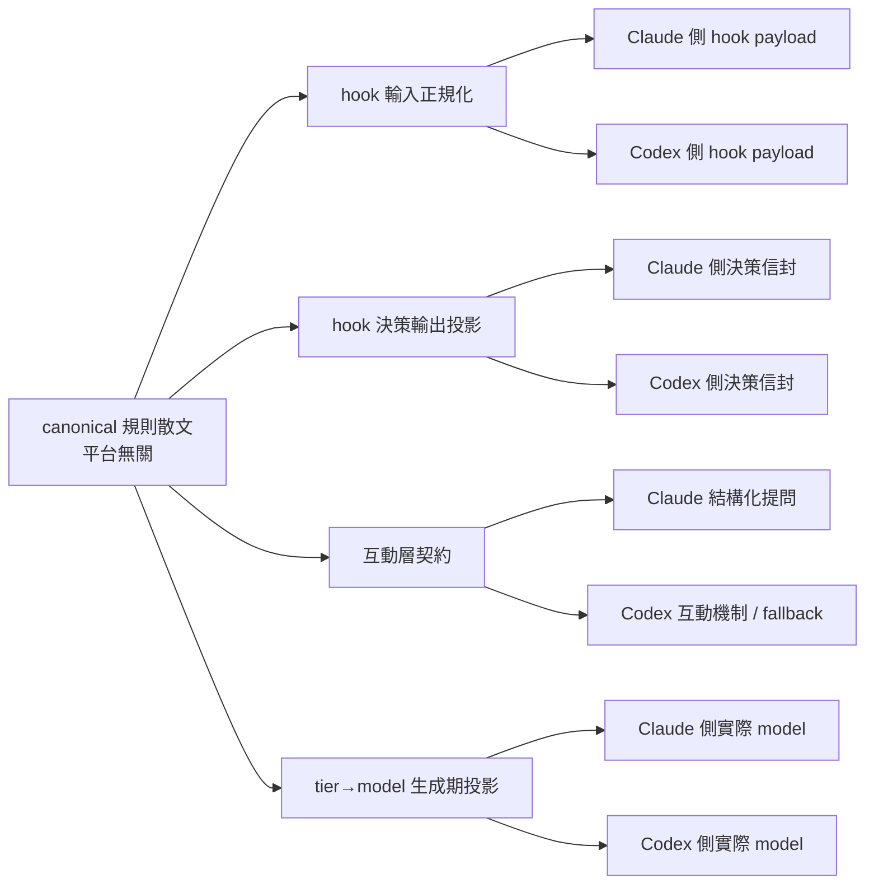

# 雙 harness 相容層（Claude Code／Codex）

> 規則與流程文字只寫一份（canonical 散文），平台差異被收斂到四個固定的投影點；改一份規則、兩個 harness 都吃到同一套邏輯，不必為每個平台複製一份文件或程式碼。

## 概念｜為什麼要有這一層

不同 harness 對「同一件事」的表達方式不一樣：hook 收到的工具呼叫 payload 形狀不同、hook 決策要回吐的 JSON 信封不同、詢問使用者的機制不同、把「這個任務該用哪個模型」映射到實際 model 名稱的方式也不同。若把這些差異直接寫進規則散文（skill／reference／agent 說明），換一個平台或平台改版，就要回頭大改每一處提到平台細節的段落，且很容易漏改導致兩邊行為悄悄分岔。

這一層的做法是反過來：**規則作者只寫「平台無關」的內容**（要做什麼判斷、要不要問人、問什麼），**平台相關的細節收斂到少數幾個具名的投影點**。加一個新平台或補一個平台的實測結果，只需要動這幾個投影點，不必逐一改寫規則散文。



## 參考｜四個投影點各在哪

1. **hook 輸入正規化**——`plugins/loops-workflow/hooks/hook-input-normalize.mjs`。把兩個平台送進 hook 的工具呼叫 payload（檔案編輯、shell 指令）判成同一組正規化欄位（是哪個 harness、實際檔案路徑、指令 token 化結果），既有 guard 一律讀正規化後的欄位，不再各自寫 ad hoc 判定。純函式葉節點：不碰環境變數、不做 IO、不 import 任何 guard，供 guard 反向 import。
2. **hook 決策輸出投影**——`plugins/loops-workflow/hooks/hook-decision-emit.mjs`。把「同一個決策（拒絕／注入上下文／擋停／純文字／不動作）在不同平台下該吐出什麼字串」收斂到單一 `emitDecision(output, harness, hookEvent)` 入口，避免各輸出點各自散抄信封格式、彼此漂移。
3. **互動層契約**——`plugins/loops-workflow/references/shared/delivery/interaction-adapter.md`。定義「需要人決定」的決策點用平台無關的四要素描述（觸發理由／選項清單／推薦標記／決策點等級），再依「能力等級」（結構化提問 → 其他互動機制 → 單一 blocking question fallback）映射到平台實際能力，不寫死某平台一定走哪一階。
4. **tier→model 生成期投影**——`plugins/loops-workflow/references/capability-registry.json` 的 `agent_tiers` / `model_tier` / `agent_effort` 三張表。子代理只宣告自己屬於哪個能力層級（例如「需要深度審查」），實際映射到哪個平台的哪個模型，由這三張表在**生成期**（agent 檔案／hooks 投影檔重生時）展開，不在執行期臨時判斷。

## 參考｜能力清單（capability-registry.json）怎麼讀

`references/capability-registry.json` 是這一層的單一資料真相源，結構分五塊：

- **`facets`**：固定 10 個能力面向（例如 plugin 根目錄解析、skill 自動探索、結構化提問、hook 事件掛鉤…），每個 facet 底下 `platforms.<平台>` 是一份描述子，固定四欄：`status`（`supported` / `degraded` / `not_measured` / `not_supported`）、`measurability`（為什麼量得到或量不到，例如需要登入帳號、無穩定介面）、`interface`（實際機制的文字描述）、`fallback`（量不到時流程怎麼辦）；`status` 不是 `supported` 時 `repro` 欄必須是一段可執行的重播指令。
- **`overrides`**：canonical 散文裡某個平台的行為真的偏離一般規則時，用一筆帶 `owner`／`rationale`／`test_ref` 的紀錄明講偏離範圍，而不是整份複製規則或整支複製 skill。
- **`deferred`**：目前明確排除在這份 registry 對帳範圍外的能力項，附排除理由。
- **`model_tier` / `agent_tiers` / `agent_effort`**：子代理能力層級 → 各平台實際模型／執行強度的映射表，供生成器在生成期展開成 agent 檔案的 frontmatter。

### 怎麼加一個 facet

facet 的鍵集合被機械檢查鎖定為「恰好等於」10 個規定 id（見下方 C4 相關檢查），不是「至少包含」——這是刻意的：**先問這是不是真的一個新的能力面向，還是既有 facet 的子案例**，避免 facet 數量隨手增生。確定要加之後：

1. 在 `capability-registry.json` 的 `facets` 加一個新的 key，填齊 `description`、`gaps_refs`（對到既有差距分析清單的對應項；沒有對應項就填 `rationale_if_no_gaps_ref` 說明理由）、`platforms.claude` 與 `platforms.codex` 兩份描述子（四欄齊全；`not_measured` 一定要有 `repro`）。
2. 同步更新 `check-registry-shape.mjs` 的規定 facet id 清單，把新 id 加進去——這一步漏掉，facet 身分檢查會紅（回報「多餘的 facet」）。
3. 若這個 facet 對應到既有差距分析清單裡的項目，補上 `gaps_refs`；沒有對應項就寫清楚 `rationale_if_no_gaps_ref`。
4. 跑機械檢查（見下一節）確認新 facet 沒有讓既有對帳規則變紅。

## 參考｜六道機械檢查各管什麼

以下檢查各自獨立、互不重複實作同一件事：

- **C2 對帳**（`compat-lint.mjs`）：`capability-registry.json` 與差距分析清單（`evals/baseline/codex/gaps.json`）互相對帳——差距分析清單每一筆要嘛被某個 facet 引用、要嘛在 `deferred` 裡，不可兩者皆無（孤兒）也不可兩者皆有（歸屬不明）；facet 的平台狀態要與它引用的差距分析筆一致（多筆狀態不一致時取最保守值），偏離須有理由說明。
- **C3 表面禁令**（`compat-lint.mjs`）：掃描 skill／reference／plugin docs／repo 根文件五個文字面，抓寫死進 canonical 散文、未標平台邊界的平台專屬互動工具名、廠商 model 名稱、機制實作細節（例如 hook payload 欄位名）；只有三種明確標註的豁免（投影區塊、runtime 範圍標記、緊貼舉例訊號詞的 inline code）不算違規。
- **C4 tier 對帳**（`compat-lint.mjs`）：對帳 `agent_tiers` / `agent_effort` / `model_tier` 三張表與 agent 檔案 frontmatter 的實際 `model:` / `effort:` 值是否一致。
- **C5 scoped override 對帳**（`compat-lint.mjs`）：canonical 散文裡每一段帶 id 的平台範圍標記，`overrides[]` 都要有對應的一筆（否則是孤兒標記）；反過來每一筆 `overrides[]` 也要在散文裡找得到至少一處真的被引用（否則是懸空宣告，只在資料層存在、從未真的被規則文字用到）。
- **C6 投影漂移**（`compat-lint.mjs`）：hook 事件掛鉤設定的 Codex 側投影檔是由 Claude 側正本＋registry 的別名對照表重新算出來的；本檢查重新算一次期望投影，與磁碟上實際投影檔逐結構比對，手改任一欄位都會被抓到，不會退化成「檔案存在即綠」。
- **殘留掃描**（`check-emit-residual.mjs`）：確認全部 production hook 的決策輸出點都真的改走「hook 決策輸出投影」這個單一入口，掃三種「繞過投影入口自己組裝決策字串」的具體寫法（例如直接手刻 JSON 信封、直接印字串常數），逮到就報。

## 操作指南｜怎麼加一個新平台

1. **在 hook 輸入正規化加判定分支**：`hook-input-normalize.mjs` 判 harness 種類的函式加一個新分支，辨識新平台的 payload 形狀（例如它怎麼傳檔案編輯內容、怎麼傳 shell 指令），並補上對應的欄位抽取邏輯，回傳統一的正規化形狀。
2. **在 hook 決策輸出投影補信封**：`hook-decision-emit.mjs` 為新平台定義五種決策種類（拒絕／注入上下文／擋停／純文字／不動作）各自該吐出的信封格式，跟既有平台分支平行存在，不動既有平台的既有信封。
3. **在能力清單每個 facet 加一個平台鍵**：`capability-registry.json` 的每個 facet 底下 `platforms` 加新平台的描述子（四欄齊全）；未實測的欄位一律標 `not_measured` 並附可執行的重播指令，不得先斬後奏標成已支援。
4. **在互動層契約補映射**：`interaction-adapter.md` 第 3 節投影段落加一段新平台的能力映射說明（該平台的結構化提問／其他互動機制／fallback 各自對應到什麼），比照既有平台的寫法包進投影標記區塊。
5. **視需要延伸投影生成器與對帳檢查**：若新平台也需要 hook 事件掛鉤設定的等價投影檔，在 registry 的對應 facet 補一份投影對照表，仿照既有生成器（讀正本＋對照表→重生投影檔）另建一支，並在 C6 檢查對應延伸驗證邏輯，不要手改生成物。
6. **全部機械檢查跑一次**：新平台的資料與程式碼落地後，跑完整的機械檢查清單（六道檢查＋殘留掃描）確認沒有新的對帳落差，尤其是 C2／C4 對帳與 facet 身分檢查——這兩處最容易因為只改了一半（例如只補了 registry 沒補判定清單）而留下懸空引用。

## 參考｜限制

- 新增一個平台目前需要人工改動上述五、六個地方，沒有單一 schema 能自動展開成所有投影點——機械檢查能抓「改了一半、彼此對不上」的落差，但不能自動幫你把新平台的每個分支寫出來。
- 目前多數 Codex 側能力描述子的狀態是「未量測」：需要一個已登入認證的隔離執行環境才能真的跑起來驗證，這個環境目前不存在，因此這些描述子暫時只能停在「依官方文件與既有差距分析推導、附可執行重播指令」的狀態，不能宣稱已驗證。
- hook 決策輸出投影裡新平台分支的信封格式，若沒有真機校驗過，只是「依規則要求（不得與未知平台等價、不得直接照搬另一平台信封）設計出的暫定結構」，實際平台送出的欄位形狀若不同，投影就不成立，需要回頭校準。
- C3 表面禁令是文字面正則掃描，只能抓「典型平台工具名／廠商 model 名稱／機制實作細節」這幾類明確清單內的字面，抓不到用同義詞或間接描述繞過清單的寫法。
- C6 投影漂移只驗證「投影檔的結構是否忠實反映正本＋對照表算出的期望值」，不驗證這份投影檔實際餵給目標平台後是否真的被正確消費——這條線同樣受限於沒有已認證的執行環境可驗。

## 怎麼自己驗證

改動任何一個投影點或能力清單後，依序跑：

```
node plugins/loops-workflow/scripts/check-registry-shape.mjs
node plugins/loops-workflow/scripts/compat-lint.mjs --root .
node plugins/loops-workflow/scripts/check-emit-residual.mjs
node plugins/loops-workflow/scripts/skill-lint.mjs
```

全綠代表：facet 身分與描述子完整性沒問題、C2–C6 對帳與表面禁令沒有新落差、決策輸出沒有繞過單一投影入口、文件索引與計數沒有漂移。若改的是 hook 事件掛鉤設定的正本或別名對照表，額外重生一次 Codex 側投影檔（讀正本＋對照表的生成器，`--write` 模式），再跑一次 C6 確認投影檔與重生結果結構相等。
